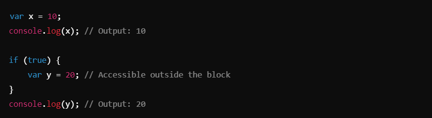
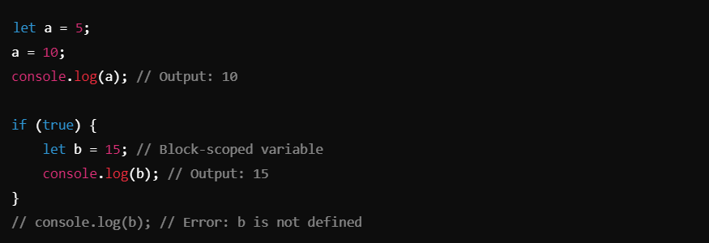
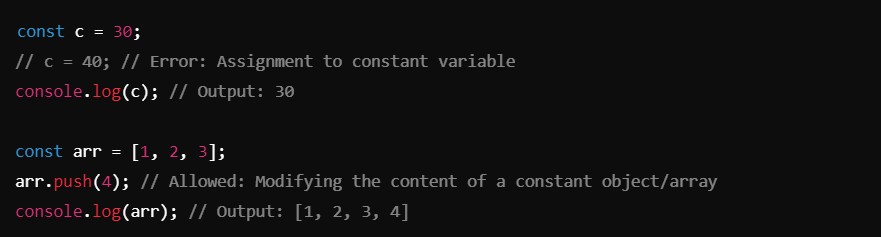
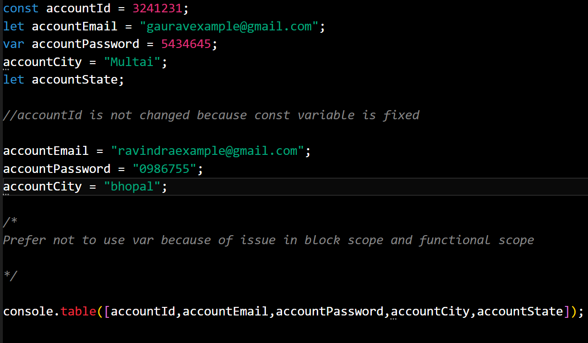

### Variable ->

## Definition of Variables in JavaScript :-
A variable is a named storage for data in JavaScript. Variables allow you to store, update, and retrieve data during the execution of a program. JavaScript provides three main keywords for defining variables:

1. ## `var` 
- **Scope**: Function or global scope.
- **Hoisting**: Variables declared with `var` are hoisted to the top of their scope but are undefined until assigned.
- **Reassignment** : Can be reassigned and redeclared within the same scope.
- **Usage** : Historically used, but it's better to use let or const due to scoping issues.

2. ## `let`
- **Scope** : Block scope (restricted to {} blocks).
- **Hoisting**: Variables are hoisted but remain uninitialized (Temporal Dead Zone).
- **Reassignment** : Can be reassigned but cannot be redeclared in the same scope.
- **Usage** : Preferred for variables that will change values.

3. ## `const`
- **Scope**: Block scope.
- **Hoisting**: Variables are hoisted but remain uninitialized (Temporal Dead Zone).
- **Reassignment**: Cannot be reassigned or redeclared.
- **Usage**: Preferred for variables whose values will not change.

# General Recommendation : 
Use `**const**` by default.
Use `**let**` if the variable needs to be reassigned.
Avoid `**var**` due to scoping issues.

## 01_variable
