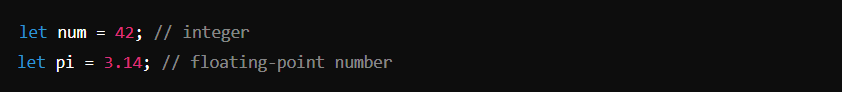
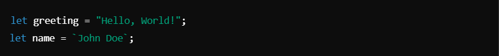
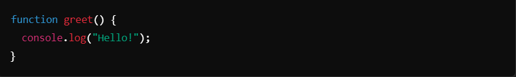
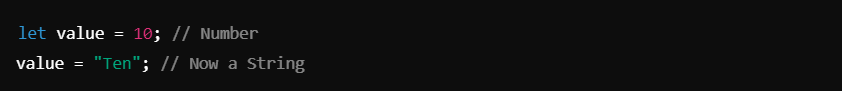
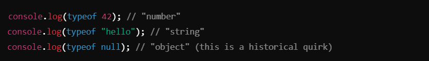

# Datatype ->
In JavaScript, a datatype refers to the kind of value a variable can hold. JavaScript is a dynamically typed language, meaning variables are not explicitly declared with a type and can change type at runtime.

## JavaScript Datatypes ->

JavaScript has two categories of datatypes:

1. ### Primitive Datatype :-
Primitive datatypes are immutable and represent single values.
-    **Number** : Represents numeric values (both integers and floating-point numbers).
   

-    **String** : Represents sequences of characters enclosed in single (`'`), double (`"`), or backticks (`).
  

-   **Boolean** : Represents logical values: `true` or `false`.
    

-   **Undefined** : Represents a variable that has been declared but not assigned a value.
    

-   **Null** : Represents the intentional absence of a value.
     

-   **Symbol** : Represents a unique identifier (introduced in ES6).
    

-   **BigInt** : Represents large integers beyond the `Number` datatype's limit (introduced in ES11/ESv2020).
    

2. ### Non-Primitive (Reference) Datatypes :-
- Reference datatypes are mutable and store objects or collections of data.

-    **Object** : Represents a collection of key-value pairs.
    

-    **Array** : Represents an ordered list of values.
    

-    **Function** : Represents executable code.
    

-    **Date** : Represents date and time.
    

### Special Notes :- 
-    **Dynamic Typing** : Variables can hold any datatype and change types during execution.
    

-    **Type Checking** : Use the `typeof` operator to check a variable's datatype.
    

In summary, JavaScript datatypes define the kinds of values a variable can hold and how they can behave during program execution.

