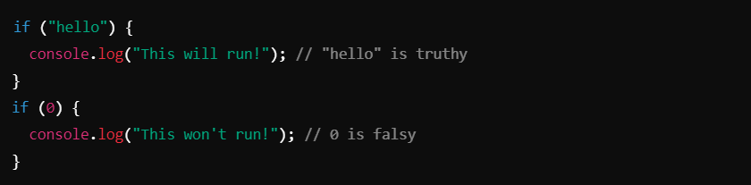
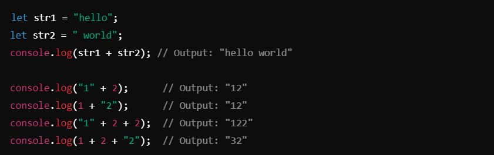

# Conversion DataType ->

## Conversion DataType in javaScript
In JavaScript, datatype conversion (or type coercion) refers to the process of converting a value from one datatype to another. This can happen explicitly (where the programmer specifies the conversion) or implicitly (where JavaScript automatically performs the conversion).

### Types of Datatype Conversion :- 

1. #### Explicit Conversion
Explicit conversion, also known as typecasting, is when the programmer explicitly converts a value to a desired datatype using JavaScript functions or methods.

- *To String*
- 

- *To Number*
- 

- *To Boolean Values* are converted to `true` or `false` based on their "truthiness." 
- 

2. #### Implicit Conversion
Implicit conversion, or type coercion, is performed automatically by JavaScript during certain operations.

- *String Coercion* : When a value is concatenated with a string, JavaScript converts other types into a string.

- *Number Coercion*: When an operator like `-`, `*`, or `/`is used, non-numeric values are converted to numbers if possible.

- *Boolean Coercion*: When a non-boolean value is used in a condition, it is coerced into a boolean (`true` or `false`).

## Examples of Type Conversion
- **Addition** (`+`) vs. **Subtraction** (`-`)

- **Equality** (`==`) vs. **Strict Equality** (`===`)

## Common Conversion Functions
1. `String(value)`: Converts to a string explicitly.
2. `Number(value)`: Converts to a number explicitly.
3. `Boolean(value)`: Converts to a boolean explicitly.
3. `parseInt(value)`: Converts a string to an integer.
4. `parseFloat(value)`: Converts a string to a floating-point number.

## Truthy and Falsy Values
When converting to a boolean, these values are considered falsy (convert to `false`):

- `0`, `""` (empty string), `null`, `undefined`, `NaN`, `false`
- All other values are truthy (convert to true).

## Key Points
- **Explicit conversion** gives you control over datatype conversion.
- **Implicit conversion** can lead to unexpected results if not handled carefully.
- Use `typeof` to inspect the type before and after conversion.

--------------------------------------------------------------------------------------------------------------------------

# JavaScript Operations and Key Concepts -> 

1. ### Unary Operations :- 
Operations involving a single operand.
- Example:
- 

2. ### Arithmetic Operators :-
Used for performing basic mathematical operations.
- 

3. ### String Concatenation (`+` with Strings) :-
The + operator can combine strings or convert other types to strings if one operand is a string.
- Examples:
- 

4. ### Operator Precedence
Controls the order in which operations are performed. Use parentheses `()` to override precedence.
Example:
- 

5. ### Unary Plus (`+`)
Converts non-numeric values to numbers.
- Examples:
- 

6. ### Assignment Operators
Used to assign values to variables.
- Examples:
- 

7. ### Increment (`++`) and Decrement (`--`)
Used to increase or decrease a value by 1.

`++variable`: Pre-increment (increments first, then uses the value).

`variable++`: Post-increment (uses the value, then increments).

Example:

## Key Notes

1. **Unary Operators**: Operate on one value (e.g., -, + for conversion).
2. **Arithmetic Operations**: Perform math using +, -, *, /, %, **.
3. **String Concatenation**: + adds strings or mixes strings and numbers into a single string.
4. **Operator Precedence**: Use parentheses to control execution order.
5. **Unary Plus**: Converts booleans or empty strings to numbers (+true => 1, +"" => 0).
6. **Assignment**: Multiple variables can be assigned the same value in one line.
7. **Increment/Decrement**: Useful for counters and loops.
Understanding these operations allows you to perform calculations, manipulate strings, and manage variable values efficiently in JavaScript!

