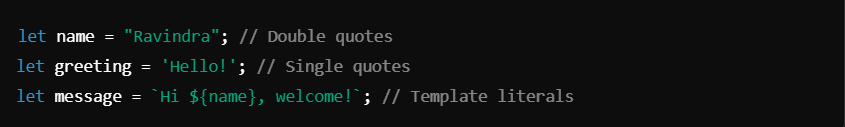
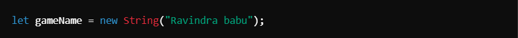
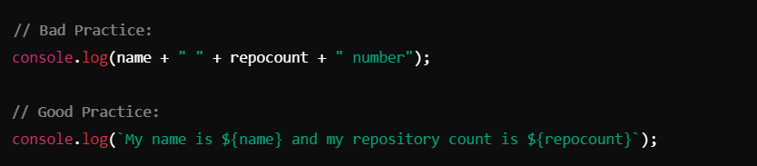
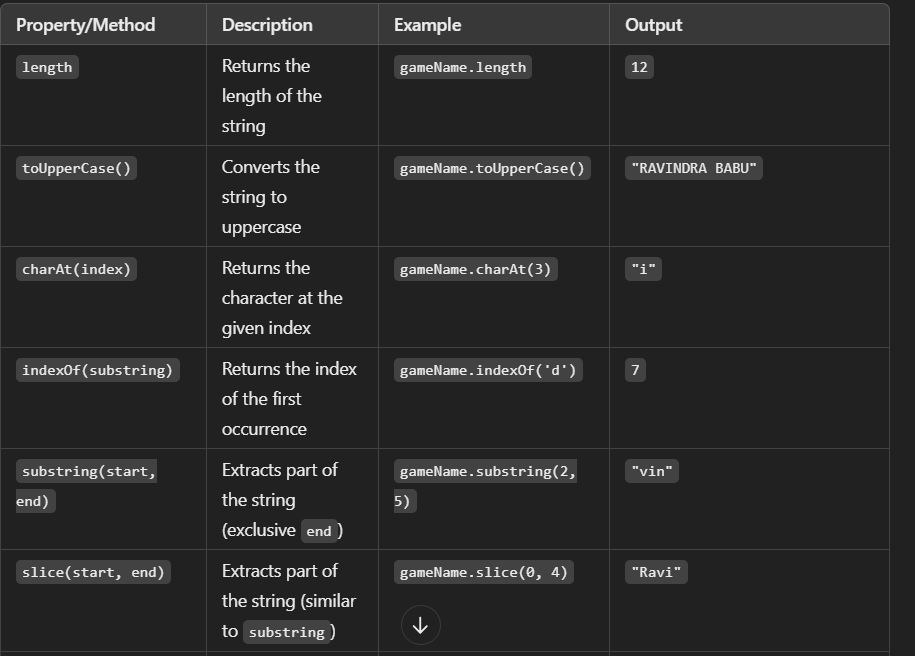
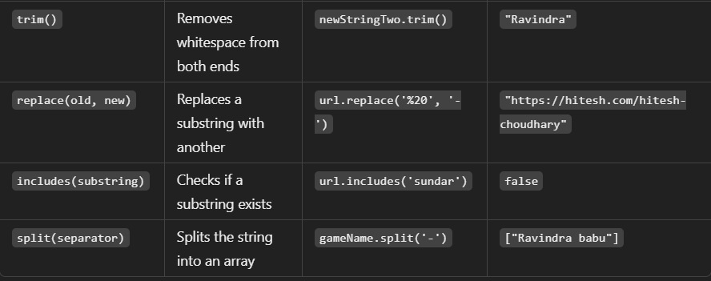
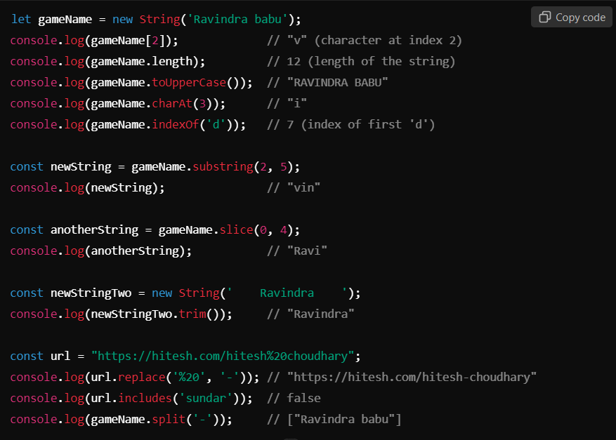

# Strings in javaScript ->

## Strings :-
A **string** in JavaScript is a sequence of characters used to represent text. Strings are immutable, meaning their content cannot be changed once created. They can be enclosed in single (`'`), double (`"`), or backticks (***`*** for template literals).

# String Declaration
1. **Primitive String** (preferred way) :

2. **String Object** (not recommended):

## Good Practice with Strings:- 
**Concatenation**: Combine strings using + (not preferred) or template literals (preferred).

## Common String Properties and Methods

## Examples

## Key Notes
1. Strings can be manipulated with a variety of built-in methods.
2. Use template literals (***`***) for clean and readable string interpolation.
3. Always use `.trim()` to remove extra spaces from user input.
4. Avoid creating string objects using `new String()`.
5. Methods like `replace()`, `includes()`, and `split()` help in advanced string manipulation.