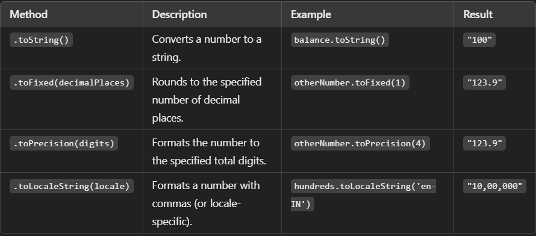
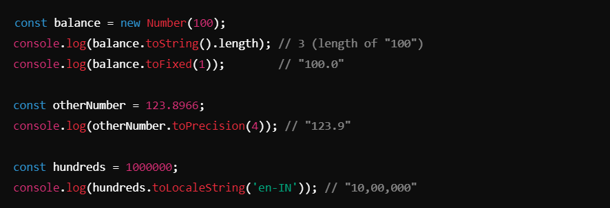
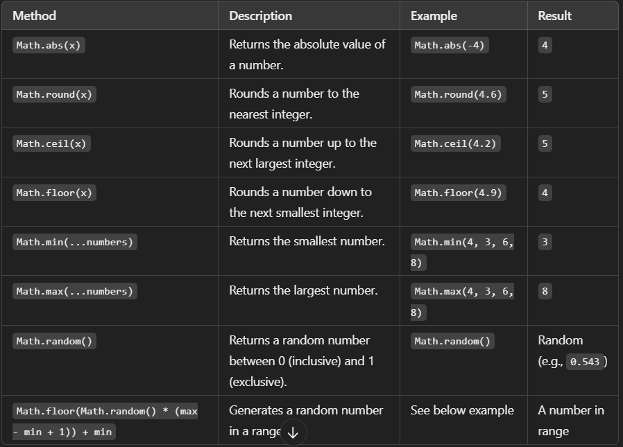
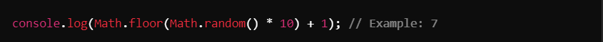
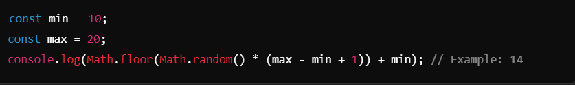
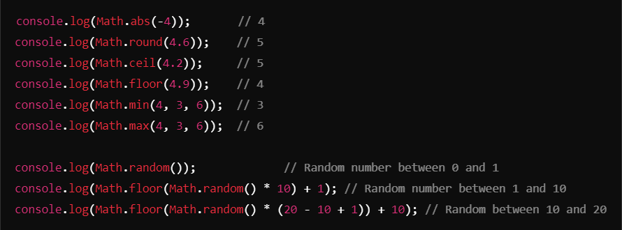

# Number and Math in JavaScript ->
JavaScript provides built-in Number and Math objects for handling numerical values and performing mathematical operations.

## Number Object :- 
The **Number** object is used to work with numbers in JavaScript and provides methods to manipulate them.

**Examples and Methods :**
- 

- **Examples:**
- 

## Math Object :- 
The **Math** object provides properties and methods for mathematical constants and functions. It is a static object, so you can use its methods directly without creating an instance.

**Common Math Methods:**

### Generating Random Numbers:
- **Random decimal number between 0 and 1:**
- 

- **Random number between 1 and 10:**
- 

- **Random number between `min` and `max`:**
- 

- ### Examples:
- 

## Key Notes 
1. ### Number Object:
- Use `.toString()` to convert numbers to strings.
- Use `.toFixed()` and `.toPrecision()` to format numbers.
- Use `.toLocaleString()` for locale-specific formatting.

2. ### Math Object:
- Provides essential mathematical operations like rounding, finding minimum/maximum, and generating random numbers.
- `Math.random()` is great for randomness but often combined with `Math.floor()` to get integers.

3. ### Random Numbers:
To generate random numbers in a range, calculate using the formula:
`Math.floor(Math.random() * (max - min + 1)) + min`.
Understanding these tools is essential for working with numbers and performing mathematical operations in JavaScript!