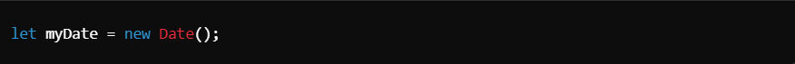
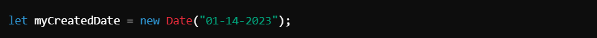
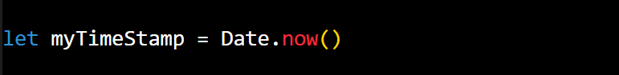
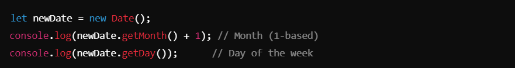
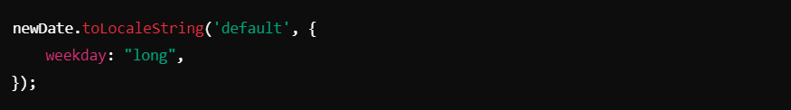

# Date Object ->

## JavaScript `Date` Object
The `Date` object in JavaScript is used to work with dates and times. It allows creating, manipulating, and formatting dates and times in various ways.

1. ### Current Date 

- Creates a `Date` object with the current date and time.

2. ### Date Methods :-
- `myDate.toString()`
Converts the `Date` object to a full string representation of the date and time, including the time zone (e.g., `"Sat Nov 18 2023 17:00:00 GMT+0530 (IST)"`).

- `myDate.toDateString()`
Converts the date portion into a human-readable string (e.g., `"Sat Nov 18 2023"`).

- `myDate.toLocaleString()`
Converts the date and time into a string formatted based on the local conventions (e.g., `"11/18/2023, 5:00:00 PM"`).

- `typeof myDate`
Returns `"object"` because `Date` is a JavaScript object.

2. ### Custom Date Creation :- 

- Creates a specific date object for January 14, 2023.
- Dates can be created using multiple formats:
- `new Date(2023, 0, 23)` → January 23, 2023 (month is zero-based).
- `new Date(2023, 0, 23, 5, 3)` → January 23, 2023, 5:03 AM.
- `new Date("2023-01-14")` → Parses a string in `YYYY-MM-DD` format.

4. ### Timestamps :-

- `Date.now()`
Returns the current timestamp (milliseconds since January 1, 1970, 00:00:00 UTC).

- `myCreatedDate.getTime()`
Returns the timestamp for `myCreatedDate`.

- `Math.floor(Date.now() / 1000)`
Converts the current timestamp to seconds.

5. ### Getting Date Components :- 

- `getMonth()`
Returns the month (zero-based, add 1 for the actual month number).

- `getDay()`
Returns the day of the week (0 for Sunday, 1 for Monday, ..., 6 for Saturday).

6. ### Weekday Name :- 

- Converts the date to a string displaying the full name of the weekday (e.g., `"Saturday"`).

## Notes
1. The `Date` object is essential for handling date and time in JavaScript.
2. Create current or custom dates using `new Date()` with different formats.
3. Timestamps represent the number of milliseconds since January 1, 1970 (Unix Epoch).
4. Use `toString()`, `toDateString()`, and `toLocaleString()` for human-readable date formats.
5. Retrieve specific date components using methods like:
-     getMonth() (month index, zero-based).
-     getDay() (day of the week, 0–6).
-     getTime() (timestamp in milliseconds).
6. Use `toLocaleString()` with options for localized or customized formats (e.g., day, weekday).