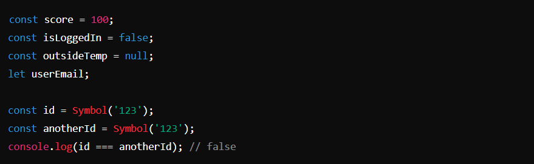
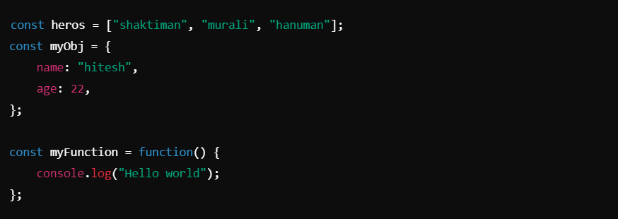
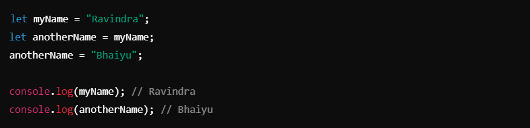
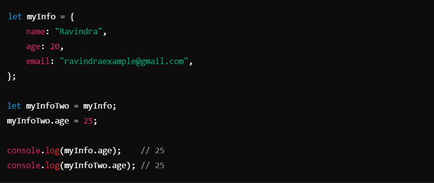

# JavaScript: Primitive and Reference Types ->
JavaScript divides data types into Primitive and Reference (Non-Primitive) types.

1. ## 1. Primitive Data Types :-
Primitive types are basic, immutable data types that are directly stored in the stack memory. Changes to one variable do not affect another.

#### Types of Primitives :-
1. **Number**: Numeric values (e.g., `100`, `100.3`).
2. **BigInt**: For large integers (e.g., `123456789012345678901234567890n`).
3. **String**: Text data (e.g., `"hello"`).
4. **Boolean**: Logical values (`true` or `false`).
5. **null**: Represents an intentional absence of value.
6. **undefined**: Variable declared but not assigned a value.
7. **Symbol**: Unique and immutable values (e.g., `Symbol('123')`).

##### Example Code
- 

- **Key Notes:**
- `null` is a placeholder for "no value."
- `Symbol` values are always unique, even if created with the same description.

_________________________________________________________________________________________________________________________________

2. ## Reference (Non-Primitive) Data Types :-
Reference types are objects stored in the heap memory, and variables only hold a reference (or pointer) to the memory location. Changes to one reference affect all references pointing to the same object.

#### Examples of Reference Types :- 
1. **Array**: Ordered collection of values.
2. **Object**: Key-value pairs.
3. **Function**: Block of code.

#### Example Code :- 

__________________________________________________________________________________________________________________________________

3. ## Memory Allocation :-
#### Primitive Types (Stack)
- Values are stored directly in the stack memory.
- Each variable has its own copy of the data.

##### Example Code :

- `anotherName` is a separate copy; modifying it does not affect `myName`.

#### Reference Types (Heap):-
- Objects are stored in the heap memory.
- Variables hold references (pointers) to the memory location in the heap.
- Modifying the object through one reference affects all other references.

- Both `myInfo` and `myInfoTwo` point to the same memory location, so changes are reflected in both.

__________________________________________________________________________________________________________________________________

## Notes :-
1. #### Primitive Types:
- Immutable.
- Stored directly in the stack.
- Examples: `Number`, `String`, `Boolean`, `null`, `undefined`, `Symbol`.

2. #### Reference Types:
- Mutable.
- Stored in the heap with a reference in the stack.
- Examples: `Array`, `Object`, `Function`.

3. #### Memory Management:
**Stack**: For small, fixed-size, primitive data.
**Heap**: For dynamic, large, or complex data structures.

5. #### Symbols:
- Always unique.
- Useful for creating unique property keys in objects.