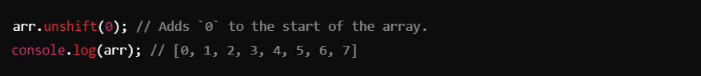

# Arrays ->

## JavaScript Arrays: Methods and Operations :-
An array in JavaScript is a collection of elements, which can be numbers, strings, objects, or other data types. Arrays are versatile and come with many built-in methods for manipulation.

1. ### Array Declaration :-

- Arrays can hold elements of any type.
- Indexing starts from `0`.

__________________________________________________________________________________________________________________________________

2. ### Accessing Elements :-

- Use the index to access elements (`arr[index]`).

__________________________________________________________________________________________________________________________________

3. ### Adding and Removing Elements :-
#### Add to Last (`push`)**:

#### Remove from Last (`pop`):

#### Add to First (`unshift`):

#### Remove to Last (`shift`):

_________________________________________________________________________________________________________________________________

4. ### Checking Array Contents :-
#### Check if an Element is Included (`includes`):

#### Find the Index of an Element (`indexOf`):

_________________________________________________________________________________________________________________________________

5. ### String Conversion :-

#### Convert Array to String (`join`):

- Joins elements into a string, separated by commas (default)

_________________________________________________________________________________________________________________________________

6. ### Array Manipulation: Slice and Splice

#### Slice (Does Not Modify Original Array):

#### Splice (Modifies Original Array):

__________________________________________________________________________________________________________________________________

## Notes :-

1. #### Array Basics:
- Arrays store multiple values in a single variable.
- Use indexes to access or modify elements.

2. #### Adding/Removing Elements:
- `push` and `pop`: Add/remove from the end.
- `unshift` and `shift`: Add/remove from the start.

3. #### Checking Array:
- `includes`: Checks if an element exists in the array.
- `indexOf`: Finds the index of an element (returns `-1` if not found).

4. #### String Conversion:
- `join`: Converts an array into a single string.

5. #### Manipulation:
- `slice`: Extracts a portion of the array without modifying it.
- `splice`: Removes or replaces elements in the array and modifies it.

6. #### Memory Efficiency:
- `slice` is non-destructive; use it when you want the original array unchanged.
- `splice` directly affects the array; use cautiously if the original array is needed elsewhere.
