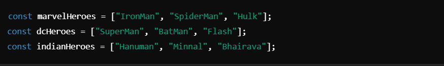
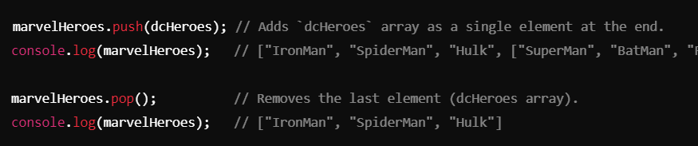
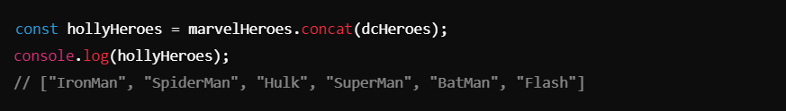
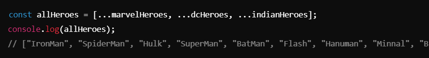
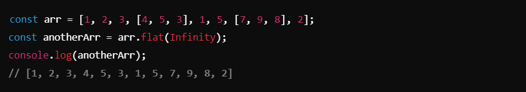
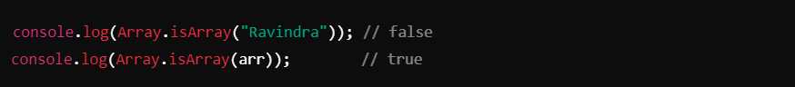
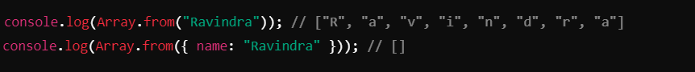
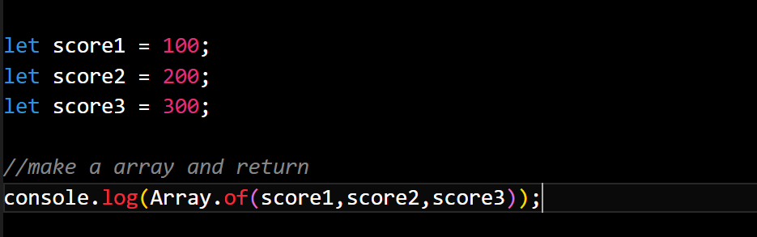

# Arrays Advanced ->

## JavaScript Arrays: Advanced Operations and Methods :-
This code demonstrates advanced array manipulation techniques such as using the spread operator, flat(), Array.isArray(), and other array-related methods.

1. ### Array Declaration :-

- Arrays store collections of values, such as strings representing superhero names.

__________________________________________________________________________________________________________________________________

2. ### Push and Pop :-

- `push()`: Adds an element (or an array) to the end of the array.
- `pop()`: Removes the last element from the array.

__________________________________________________________________________________________________________________________________

3. ### Concatenation :-

- `concat()`: Combines two or more arrays into a new array without modifying the original arrays.

__________________________________________________________________________________________________________________________________

4. ### Spread Operator :-

- 

- `...` **(Spread Operator)**: Spreads elements of an array into another array. Useful for merging arrays.

__________________________________________________________________________________________________________________________________

5. ### Nested Arrays and Flattening :-

- `flat()`: Flattens nested arrays into a single array.
-    `flat(Infinity)`: Flattens all levels of nested arrays.

__________________________________________________________________________________________________________________________________

6. ### Checking and Converting Arrays :-
#### Check if an Object is an Array (`Array.isArray`):

- `Array.isArray()`: Checks whether a value is an array.

#### Convert to Array (`Array.from`):

- `Array.from()`: Converts an iterable or array-like object to an array.
- For non-iterable objects, it returns an empty array.

_________________________________________________________________________________________________________________________________

7. #### Creating Arrays :-
- `Array.of()`:
- 

- `Array.of()`: Creates a new array from its arguments.

________________________________________________________________________________________________________________________________

## Notes :-

1. #### Basic Operations:
- `push`: Add elements to the end.
- `pop`: Remove the last element.

2. #### Combining Arrays:
- `concat()`: Combines multiple arrays without modifying originals.
- **Spread Operator**(`...`): Merges arrays and spreads elements.

3. #### Nested Arrays:
- `flat()`: Flattens nested arrays into a single array. Use `Infinity` for unlimited levels.

4. #### Array Checks:
- `Array.isArray()`: Checks if a value is an array.
- `Array.from()`: Converts iterable objects (like strings) into arrays.

5. #### Array Creation:
- `Array.of()`: Creates an array from given values, regardless of type.

6. #### Practical Uses:
- Flatten arrays with `flat()` to simplify working with deeply nested structures.
- Merge arrays with the spread operator or `concat()` for cleaner code.
- Use `Array.from()` to transform iterables into arrays for further operations.