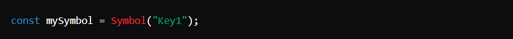
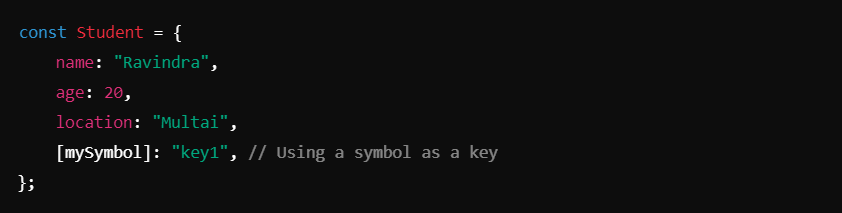
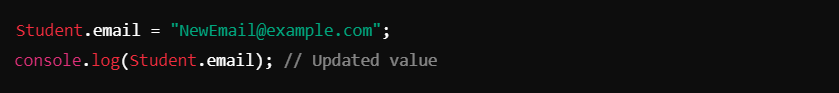
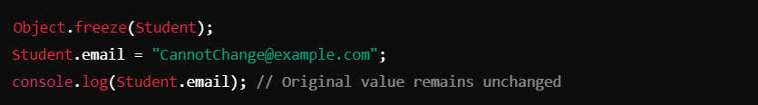
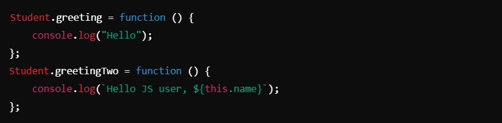
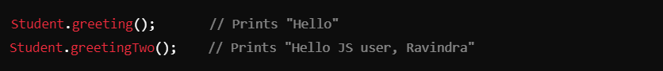
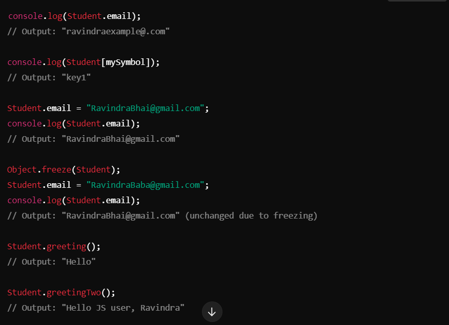

# Object ->

## Definition of an Object in JavaScript :-

In JavaScript, an object is a collection of related data (properties) and functions (methods) organized as key-value pairs. Objects can store multiple values and behaviors, making them a fundamental building block for more complex data structures and functionality.

## Key Notes :-
1. #### Symbol :-
- `Symbol()` creates a unique and immutable data type that can be used as a property key in objects. It helps avoid property name collisions.

- Example :
- 
- Here, `mySymbol` is used as a property key in the `Student` object.

2. #### Object Literals :-
- Objects are created using the `{}` syntax, containing key-value pairs.
- Example :
-  

3. #### Accessing Object Properties :-
- **Dot notation**: Access properties directly using a dot (`.`)

- **Bracket notation**: Use square brackets and the property name as a string. Useful for dynamic or special character keys.
- 

4. #### Updating Object Properties :-
- Object properties can be updated directly.

5. #### Freezing Objects :-
- `Object.freeze()` prevents modification of existing properties and addition or removal of new properties.

6. #### Adding Methods to Objects :-
- Functions can be added to an object as methods. They can access object properties using `this`.

7. #### Invoking Methods :-
- Methods are called using `object.methodName()`.

_________________________________________________________________________________________________________________________________

## Example Output :-

_________________________________________________________________________________________________________________________________

## Summary :-
1. **Symbol**: Creates unique keys for object properties.
2. **Accessing Properties**: Use dot or bracket notation.
3. **Updating Properties**: Directly assign new values to properties.
4. **Freezing Objects**: Use `Object.freeze()` to make objects immutable.
5. **Adding Methods**: Assign functions to object properties for dynamic behaviors.
6. **Methods with `this`**: Use `this` to refer to the current object within a method.