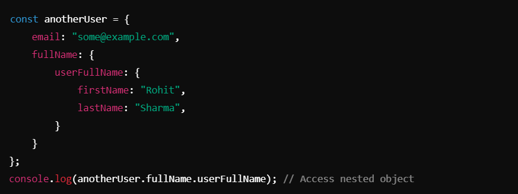

# JavaScript Objects and JSON Concepts with Examples ->

1. ### Creating Objects :-
#### Singleton Object :-
- A singleton object is created using the `Object` constructor. It ensures a single instance of the object.

__________________________________________________________________________________________________________________________________

2. ## Adding Properties to an Object :-
- Properties can be added to an object dynamically after creation.

__________________________________________________________________________________________________________________________________

3. ## Nested Objects :-
- Objects can contain other objects as properties.

__________________________________________________________________________________________________________________________________

4. ## Merging Objects :-
 #### Using `Object.assign`
- Creates a new object by copying all properties from source objects.

#### Using Spread Operator :-
- Simpler syntax to merge objects.

#### Incorrect Method (Object Containing Other Objects) :-
- This nests objects instead of merging them

_________________________________________________________________________________________________________________________________

5. ## Objects in Arrays :-
- Objects can be stored within arrays for structured data.

_________________________________________________________________________________________________________________________________

6. ## Object Methods :-
#### Access Object Data :-
- `Object.keys(obj)`: Returns an array of keys.
- `Object.values(obj)`: Returns an array of values.
- `Object.entries(obj)`: Returns an array of `[key, value]` pairs.

- **Example** :-

#### Check if a Key Exists :-
- `obj.hasOwnProperty(key)`: Returns `true` if the key exists, `false` otherwise.

_________________________________________________________________________________________________________________________________

7. ## Object Destructuring :-
- Extract properties from an object into individual variables.

__________________________________________________________________________________________________________________________________

8. ## JSON (JavaScript Object Notation) :-
JSON is a lightweight data interchange format that resembles JavaScript objects but is stricter (keys and strings must use double quotes).

#### JSON Example :-

#### Array of JSON Objects :-
- JSON can also represent arrays of objects.

__________________________________________________________________________________________________________________________________

9. ## Key Differences Between Objects and JSON :-
- JSON is a lightweight data interchange format that resembles JavaScript objects but is stricter (keys and strings must use double quotes).

#### JSON Example :-

#### Array of JSON Objects :-
- JSON can also represent arrays of objects.

__________________________________________________________________________________________________________________________________

9. ## Key Differences Between Objects and JSON :-

__________________________________________________________________________________________________________________________________

10. ## Key Notes :-
- Use destructuring for cleaner code and direct access to properties.
- Use `Object.assign` or the spread operator for merging objects.
- JSON is widely used for APIs and web communication due to its simplicity and lightweight nature.

__________________________________________________________________________________________________________________________________