# Functions ->

## JavaScript Functions: Definitions :-

1. ### Basic Function :-
- Functions are reusable blocks of code that perform a specific task.

#### Example: A Simple Function
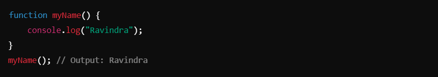

_________________________________________________________________________________________________________________________________

2. ### Function with Parameters :-
- You can pass parameters to a function to make it dynamic.

#### Example: Adding Two Numbers :-
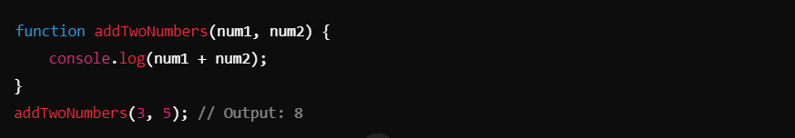

_________________________________________________________________________________________________________________________________

3. ### Functions Without `return` :-
- If a function doesn’t explicitly return a value, it returns `undefined` by default.

#### Example: No `return` Statement :-
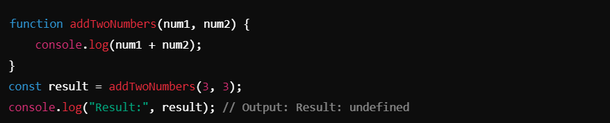

__________________________________________________________________________________________________________________________________

4. ### Functions With `return`:-
- The `return` statement sends a value back to where the function was called.

#### Example: Returning Values :-
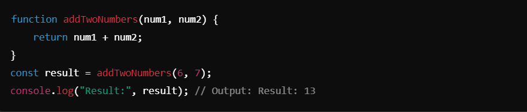;

__________________________________________________________________________________________________________________________________

5. ### Storing return Value in a Variable :-
- You can assign the returned value of a function to a variable.

##### Example :
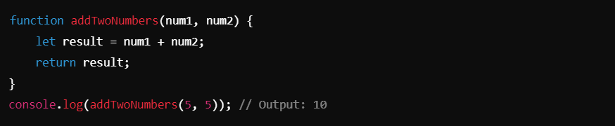

________________________________________________________________________________________________________________________________

6. ### Default Parameters :-
You can handle cases where parameters are not provided by checking for `undefined` or using default values.

#### Example: Handling Undefined Parameters :-
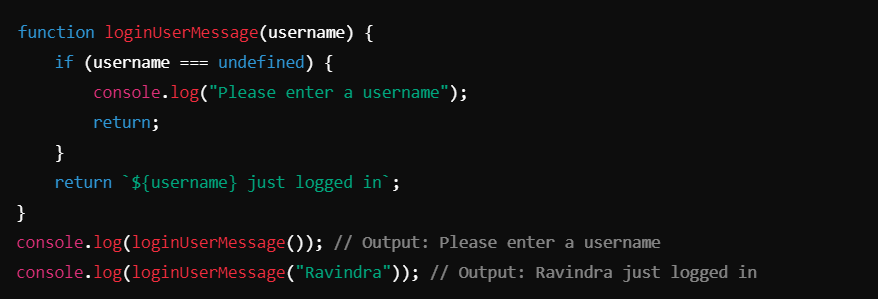

_________________________________________________________________________________________________________________________________

7. ## Functions in Objects :-
- You can pass an object as a parameter to functions to access its properties.

#### Example :-
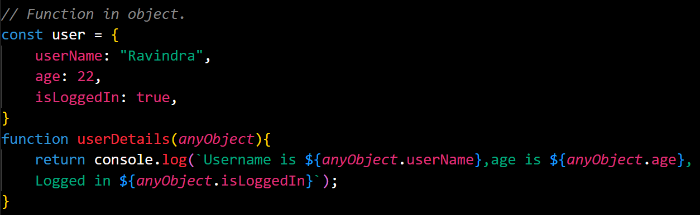
- You can also pass an object directly:
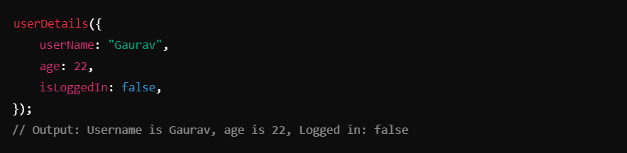

_________________________________________________________________________________________________________________________________

8. ## Functions in Arrays :-
- You can pass arrays as arguments and manipulate them within a function.

#### Example :-
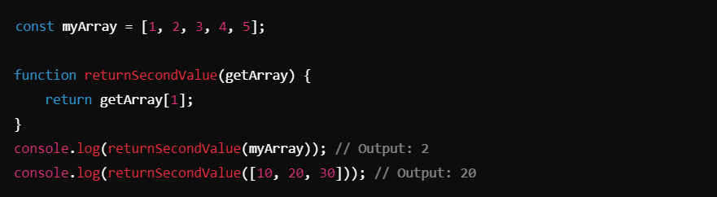

_________________________________________________________________________________________________________________________________

9. ## Rest Operator in Functions :-
- The `rest` operator (`...`) allows a function to accept an indefinite number of arguments as an array.

#### Example: Rest Operator :-
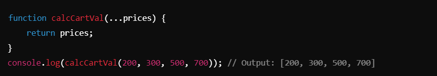
- You can also use the `rest` operator alongside normal parameters:
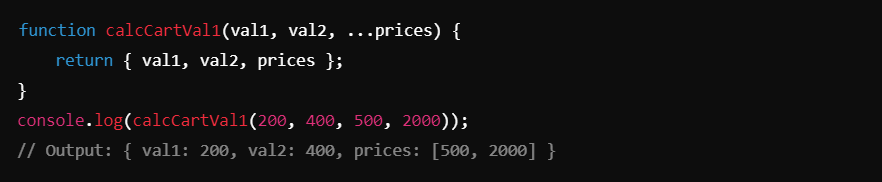

_________________________________________________________________________________________________________________________________

10. ## Key Notes :- 
Key Notes

1. **Defining Functions**:
- `function functionName() {}` is the basic syntax for creating a function.
- Functions can take parameters and return values.

2. **Parameters vs. Arguments**:
- **Parameters**: Variables listed in the function definition.
- **Arguments**: Actual values passed to the function during the call.

3. **Return Statement**:
- The `return` statement ends function execution and returns a value.
- If no `return` is used, the function returns `undefined`.

4. **Rest Operator (`...`)**:
- Used to group remaining arguments into an array.
- Helpful for working with variable numbers of arguments.

5. **Functions and Objects**:
- Functions can accept objects and arrays, making them versatile for handling complex data structures.

6. **Functions in Arrays**:
- Arrays can be passed to functions, and specific elements can be accessed or manipulated.

__________________________________________________________________________________________________________________________________