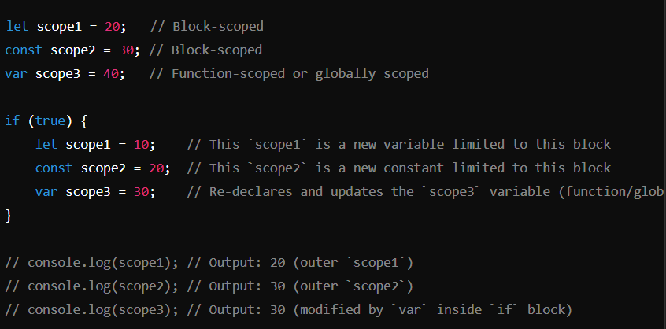
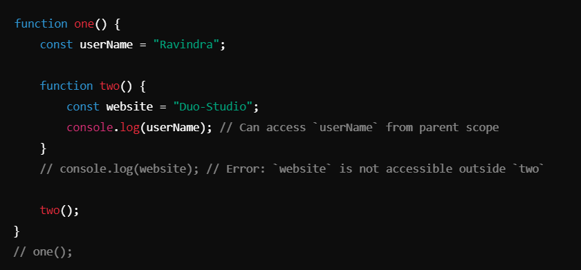
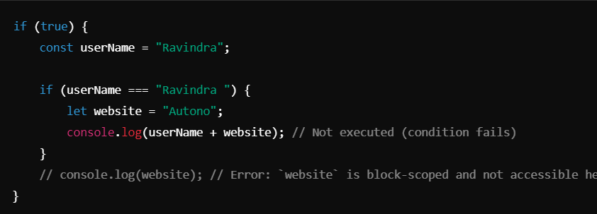
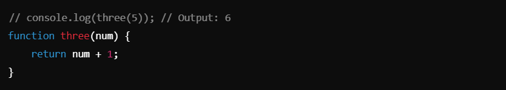
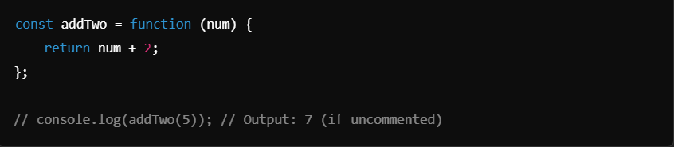

# Scope ->

### Scope Demonstrations :-
1. `let` and `const` are block-scoped, while `var` is function-scoped (or globally scoped if declared outside a function).

**Notes** :
- `let` and `const` do not overwrite variables with the same name outside their block.
- `var` ignores block scope; it re-declares and modifies the variable at the function or global scope.

__________________________________________________________________________________________________________________________________

2. ### Nested Function Scopes :-

**Notes**:
- Inner functions have access to variables declared in their parent functions (lexical scoping).
- Variables inside a function are not accessible outside that function unless returned or exposed.

_________________________________________________________________________________________________________________________________

3. ### Conditional Scopes with `let` and `const` :-

**Notes**:
- Variables declared with `let` or `const` are scoped to the nearest enclosing block (like loops or `if` blocks).
- Attempting to access block-scoped variables outside their block results in a `ReferenceError`.

________________________________________________________________________________________________________________________________

## Function Hoisting :-

1. ### Function Declaration (`three`) :-

**Explanation**:
- Function declarations are hoisted to the top of their scope, meaning they can be called before they are defined in the code.

_________________________________________________________________________________________________________________________________

2. ### Function Expression (`addTwo`) :-

**Explanation**:
- Function expressions are not hoisted. They behave like regular variables and can only be used after the assignment is made.
- Attempting to call `addTwo` before its declaration results in a `ReferenceError`.

________________________________________________________________________________________________________________________________

## Key Takeaways

1. **Scope Behavior**:
- `let` and `const` are block-scoped.
- `var` is function-scoped or global if declared outside functions.

2. **Nested Scopes**:
- Inner functions can access variables from their parent scope (lexical scoping).

3. **var** inside blocks:
- Overwrites the same variable in its enclosing function or global scope.

4. **Function Declarations vs. Expressions**:
- Declarations are hoisted and can be called before their definition.
- Expressions are not hoisted and must be defined before being called.

__________________________________________________________________________________________________________________________________