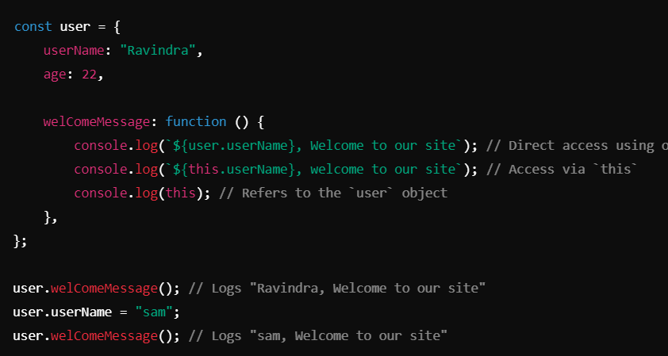
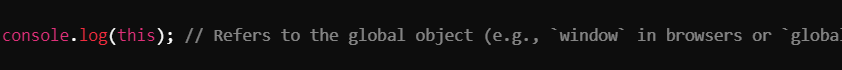
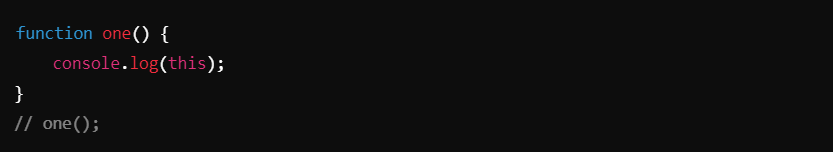
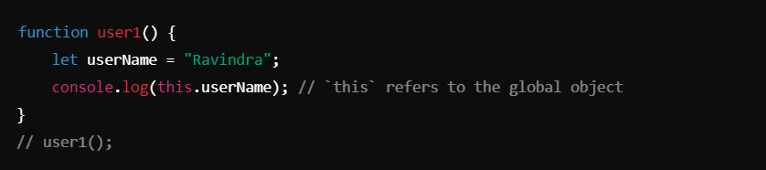
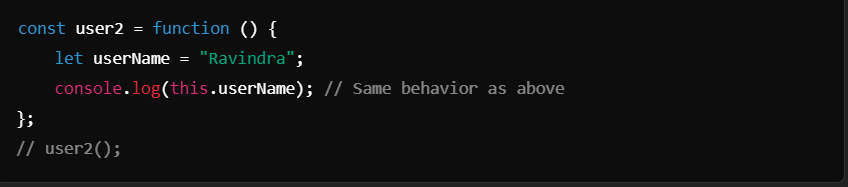
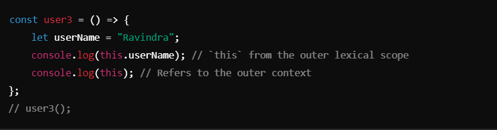
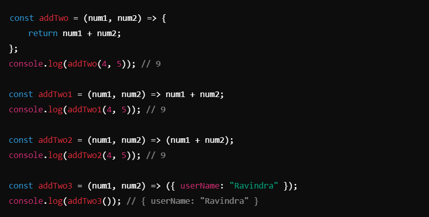
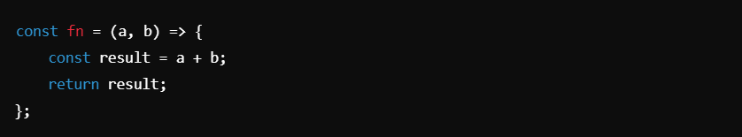

# Arrow Function & `this`->

## Object and `this` :-

1. #### Object Method: `welComeMessage` :

**Key Points**:
- Accessing `user.userName` works directly but is less flexible if the object changes or you use inheritance.
- Using `this.userName` makes the method dynamic, as `this` refers to the object the method is called on.
- Note: `this` refers to the object (`user`) here because the method is called as `user.welComeMessage()`.

_________________________________________________________________________________________________________________________________

## Global `this` and Functions :

2. #### Global `this` Context :

**Key Points**:
- In the global scope, `this` refers to the global object.

3. #### Standalone Function: `one`:

**Key Points**:
- When `one` is called as a standalone function, `this` refers to the global object in non-strict mode (`undefined` in strict mode).

__________________________________________________________________________________________________________________________________

## Standalone Functions Inside Objects :
4. #### Regular Function in `user1` :

**Key Points**:
Regular functions, when invoked standalone, do not bind `this` to the calling context. Instead, `this` defaults to the global object (or `undefined` in strict mode).

5. #### Regular Function Expression in `user2` :

**Key Points**:
- Function expressions behave like regular functions concerning `this`.

6. #### Arrow Function in `user3` :

**Key Points**:
- Arrow functions do not have their own `this`; they inherit `this` from the outer lexical scope.

__________________________________________________________________________________________________________________________________

## Arrow Functions Simplified :
7. #### Arrow Function Return Styles :

**Key Points**:
- Explicit `return`: Use curly braces `{}` and the `return` keyword for multiple statements.
- Implicit `return`: Omit curly braces for single expressions.
- To return an object literal, enclose it in parentheses `({ ... })`.

________________________________________________________________________________________________________________________________

## Key Takeaways:

this in Different Contexts

1. **Object Methods**:
- `this` refers to the object the method is called on.

2. **Standalone Functions**:
- `this` refers to the global object or `undefined` in strict mode.

3. **Arrow Functions**:
- Do not have their own `this`. They inherit `this` from the enclosing lexical scope.

#### Arrow Function Syntax
1. Single Expression:

2. Object Literal Return:

3. Multiple Statements:

- These notes help clarify common behaviors of `this` and variations in function syntax.
