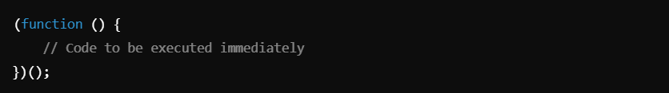
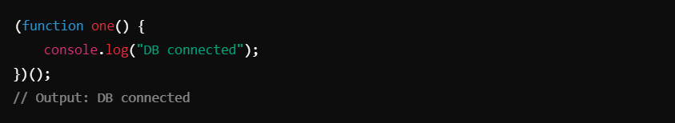
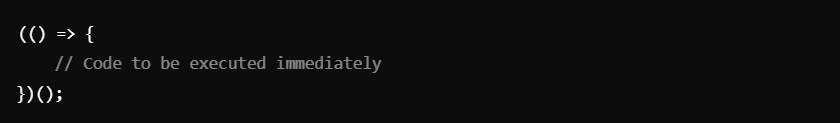
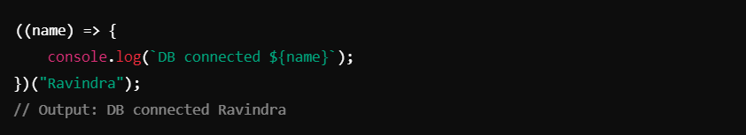
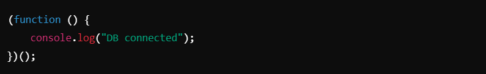
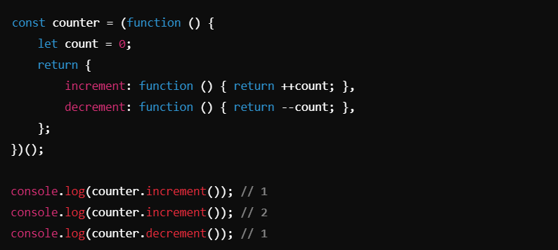
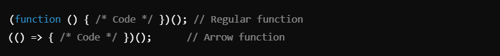

# Immediately Invoked Function Expression (IIFE) :

## Definition: Immediately Invoked Function Expression (IIFE) :
An IIFE (Immediately Invoked Function Expression) is a function in JavaScript that runs immediately after it is defined. It’s a common pattern used to create a new scope, execute code immediately, and avoid polluting the global namespace.

### Syntax :-
1. #### Standard Function IIFE :

- **Example**

- The function is **wrapped in parentheses** to make it an expression.
- The `()` after the function executes it immediately.

2. **Arrow Function IIFE** :

- **Example** :

- Arrow functions can also be used for IIFEs.
- Any arguments can be passed during invocation.

__________________________________________________________________________________________________________________________________

## Key Points About IIFEs :
1. **Scope Isolation**
- IIFEs create a private scope for the code inside, preventing variable pollution in the global namespace.
- Useful for avoiding conflicts in large codebases.

2. **One-Time Execution**
- The function is immediately executed and not reusable unless explicitly designed to return reusable components.

3. **Common Use Cases**
- Initialization code, such as setting up configurations or connections:

- Creating private variables and avoiding name collisions:

__________________________________________________________________________________________________________________________________

## Advantages of IIFEs

1. **Encapsulation**:
- Variables defined inside the IIFE are not accessible outside it.

2. **Avoid Polluting Global Scope**:
- Ensures variables and functions don’t interfere with other parts of the code.

3. **Immediate Execution**:
- Great for setup code like connecting to a database or initializing settings.

__________________________________________________________________________________________________________________________________

## Summary
- **IIFE**: A function that runs immediately after definition.

- #### Why use it?
- Avoid polluting the global scope.
- Isolate code and create private variables.
- Useful for setup/initialization tasks.

- **Syntax Variants**:
- 
