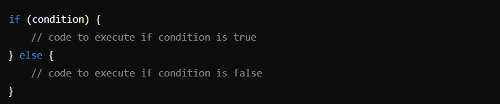
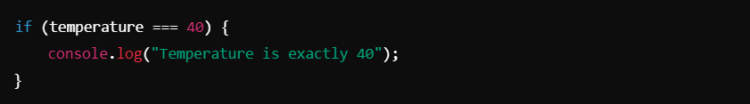
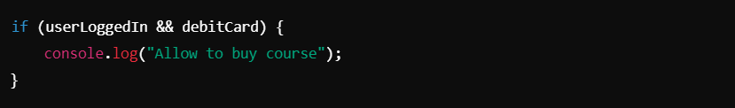
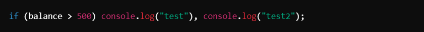
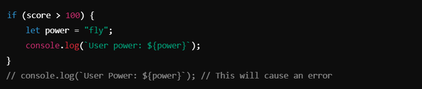

# Conditional Statement ->

1. **if-else Statement:** 
- It executes a block of code if a specified condition evaluates to `true`. The `else` block is executed if the condition is `false`.

2. **Comparison Operators :**
- Used to compare values:
- `>`: Greater than
- `<`: Less than
- `>=`: Greater than or equal to
- `<=`: Less than or equal to
- `==`: Equal to (performs type conversion)
- `!=`: Not equal to (performs type conversion)
- `===`: Strict equality (no type conversion)
- `!==`: Strict inequality (no type conversion)

- Example:
- 

3. **Logical Operators**:
- Combine multiple conditions:
- `&&`: Logical **AND** (both conditions must be `true`)
- `||`: Logical **OR** (at least one condition must be `true`)

- Example:
- 

4. **Single-line if Statements**:
- Useful for short conditions.
- You can use a comma `,` to chain multiple actions:

5. **Scope of Variables in Blocks :**
- Variables declared inside a block (`let` or `const`) are block-scoped.

__________________________________________________________________________________________________________________________________
## Summary Notes:

**if-else**:
- Conditional statements for decision-making in code.

**Comparison Operators**:
- `==` vs. `===`: Use `===` for strict comparison without type conversion.
- `!=` vs. `!==`: Use `!==` for strict inequality.

**Logical Operators**:
- `&&`: True if all conditions are true.
- `||`: True if at least one condition is true.

**Block Scope**:
- Variables declared inside a block with `let` or `const` are not accessible outside the block.

**Single-line if**:
- For short conditions, you can write in one line, separating actions with commas.

By understanding and combining these concepts, you can handle complex decision-making scenarios in JavaScript programs.

