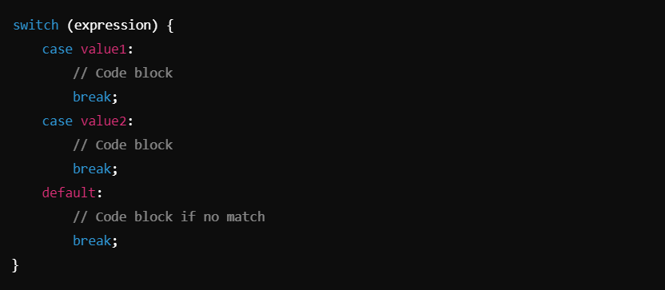

# Switch Statement ->

## Defination :

1. ### `switch` Statement :- 
- **Definition:**
- The `switch` statement is a control flow construct that evaluates an expression and executes the block of code associated with the matching case. If no case matches, the `default` block executes.

- **Syntax** :

**Key Components:**

- `switch(expression)`: Evaluates an expression (e.g., month in the code).
- `case value`:: Represents a potential match for the expression. Executes the code block below it if matched.
- `break`: Exits the `switch` statement after executing a matching case. Without it, the code "falls through" to the next case.
- `default`: Executes if none of the `case` values match the expression.

_________________________________________________________________________________________________________________________________

## Practical Applications of `switch`:

1. **Menu Selection:**
- Handling options in a user interface.

2. **Routing:**
- Determining which component/page to load based on a value.

3. **Error Handling**:
- Responding to specific error codes with predefined actions.

By using the `switch` statement effectively, you can write cleaner, more readable code for scenarios involving multiple potential outcomes for a single variable or expression.
