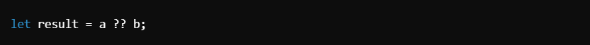

# Truthy & Falsy ->

## Key Concept ->

1. ### Falsy and Truthy Values:
#### Definition:
- **Falsy values**: Evaluate to false in a boolean context.
- **Truthy values**: Evaluate to true in a boolean context, even if not explicitly true.

#### Falsy Values in JavaScript:
`false`, `0` , `-0` , `BigInt(0n)` , `""` (empty string) , `null` , `undefined` , `NaN`.

#### Truthy Values in JavaScript:
- **Any non-falsy value, including:**
- Non-empty strings (`"false"`, `"0"`, etc.)
- Non-empty arrays (`[]`)
- Non-empty objects (`{}`)
- Functions (`function(){}`)

- **Example from Code**:

- Since `userEmail` is an empty array, it is truthy. Output: **"Email present".**

_________________________________________________________________________________________________________________________________

2. ### Checking for Empty Arrays/Objects
#### Empty Arrays:
- `[].length === 0`: Checks if an array is empty.

##### Example:

Output: **"Array is Empty"** (since `userEmail` has no elements).

#### Empty Objects:
- `Object.keys(obj).length === 0`: Checks if an object is empty by evaluating the number of keys.

##### Example:

Output: **"Object is Empty"** (since `emptyObject` has no keys).

________________________________________________________________________________________________________________________________

3. ### Nullish Coalescing Operator (??)

#### Definition:
The `??` operator returns the right-hand operand if the left-hand operand is `null` or `undefined`. Otherwise, it returns the left-hand operand.

- ##### Syntax:

- **Behavior**:

 `null ?? b`: Returns `b`.
`undefined ?? b`: Returns `b`.
`0 ?? b`: Returns `0` (because `0` is not null/undefined).

- ##### Examples :

_________________________________________________________________________________________________________________________________

4. ### Ternary Operator

#### Definition:
- The ternary operator provides a shorthand for `if-else` statements.

- ##### Syntax:

##### Example from Code:

- Since `iceTeaPrice = 100`, the condition `iceTeaPrice <= 80` is `false`.
- Output: **"More than 80"**.

__________________________________________________________________________________________________________________________________

## Summary Notes

#### Falsy and Truthy Values:
- **Falsy Values**:
- `false`, `0`, `-0`, `""`, `null`, `undefined`, `NaN`, `BigInt(0n)`

- **Truthy Values**:
- Non-empty strings, arrays, objects, functions.

#### Nullish Coalescing Operator (`??`):
- Returns the right-hand operand if the left-hand operand is `null` or `undefined`.

#### Ternary Operator:
Shorthand for `if-else`:

#### Checking for Empty Structures:
- **Arrays**: `arr.length === 0`.
- **Objects**: `Object.keys(obj).length === 0`.

_________________________________________________________________________________________________________________________________

## Practical Applications
1. **Falsy/Truthy Handling**:
- Verify user input or configuration settings.

2. **Nullish Coalescing (??)**:
- Set default values for variables.

3. **Ternary Operator**:
- Simplify inline conditional logic.

4. **Empty Array/Object Checks**:
- Validate data structures in applications.

__________________________________________________________________________________________________________________________________