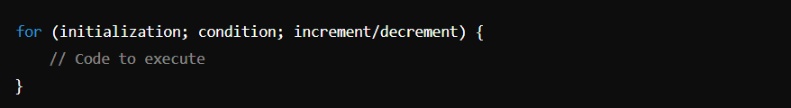
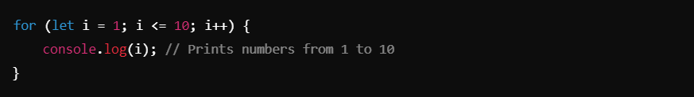
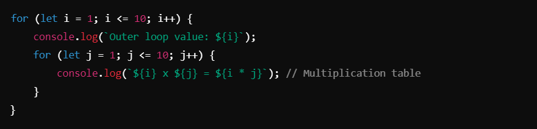
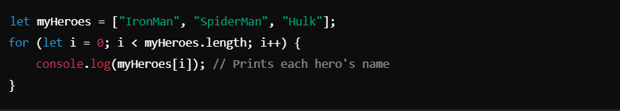
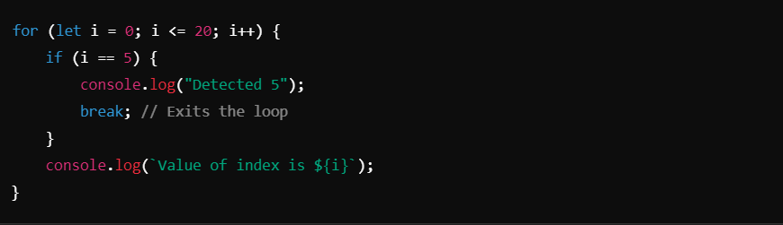
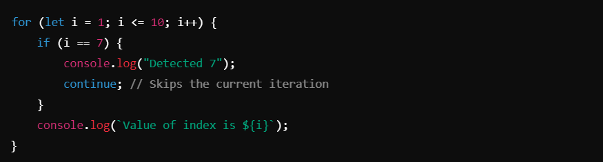

# loops ->

## Definition of a Loop ->
A **loop** is a programming construct that allows the execution of a block of code repeatedly, either for a specified number of times or until a certain condition is met. Loops are used to automate repetitive tasks efficiently.

### For Loop :
The for loop is a control structure that repeats a block of code a specific number of times. It includes three main parts:
1. **Initialization**: Executed once before the loop starts.
2. **Condition**: Evaluated before each iteration; if true, the loop continues.
3. **Increment/Decrement**: Updates the loop counter after each iteration.

##### Synatax :-

##### Example :-

_________________________________________________________________________________________________________________________________

### Nested For Loop :
A nested loop is a loop inside another loop. The inner loop executes all its iterations for each iteration of the outer loop.
**Use Case**: Generating tables, patterns, or processing multidimensional data.

##### Example:

__________________________________________________________________________________________________________________________________

### Looping Through Arrays :
Loops are commonly used to iterate over arrays, accessing elements by their index.

##### Example :

__________________________________________________________________________________________________________________________________

### Break and Continue Statements :

**Break**: Terminates the loop entirely when a condition is met.
**Continue**: Skips the current iteration and proceeds to the next iteration.

##### Break Example :-

##### Continue Example :-

__________________________________________________________________________________________________________________________________

### Key Notes :
1. **For Loop Basics**:
- Initializes a counter variable.
- Repeats as long as the condition is `true`.
- Updates the counter after each iteration.

2. **Nested Loops**:
- Useful for working with tables, patterns, or multi-dimensional arrays.
- Inner loop completes its cycle before the outer loop increments.

3. **Arrays in Loops**:
- Access elements using `array[index]`.
- Use .length property to determine the array size.

4. **Break and Continue**:
- `break` stops the entire loop.
- `continue` skips the rest of the loop body for the current iteration.

5. **Common Applications**:
- Printing numbers or patterns.
- Creating multiplication tables.
- Iterating over data structures like arrays.