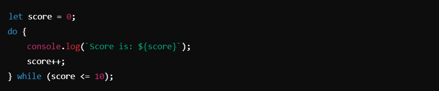

# While and Do-While Loops ->

### While Loop :
The while loop is a control structure that repeatedly executes a block of code as long as a specified condition evaluates to `true`. If the condition is `false` initially, the loop is not executed at all.

##### Syntax :-

##### Example:

__________________________________________________________________________________________________________________________________

### While Loop with Arrays :
- A `while` loop can also be used to iterate through an array by checking its index within bounds.

##### Example :

_________________________________________________________________________________________________________________________________

### Do-While Loop :
The do-while loop is a variation of the `while` loop that executes the block of code at least once, regardless of whether the condition is `true`. The condition is checked after the execution of the code block.

##### Syntax :-

##### Example :- 

__________________________________________________________________________________________________________________________________

### key Notes :

1. **While Loop**:
- Executes a block of code while the condition is `true`.
- Commonly used when the number of iterations is not known beforehand.
- Ensure the loop condition changes to avoid infinite loops.

2. **Looping Through Arrays**:
- Use the `while` loop to iterate through an array by managing an index counter.
- Compare the index with the array's `.length` property to prevent out-of-bound errors.

3. **Do-While Loop**:
- Executes the block at least once, regardless of the condition.
- Useful when the code needs to run at least once before checking a condition.

4. Differences Between While and Do-While:
- **While**: Checks the condition first, may not execute at all if the condition is `false`.
- **Do-While**: Executes once before checking the condition, ensures at least one execution.

5. **Key Use Cases**:
- **While Loops**: For conditions where the number of iterations is unknown or depends on runtime data.
- **Do-While Loops**: When the loop must execute at least once (e.g., user input validation).

__________________________________________________________________________________________________________________________________