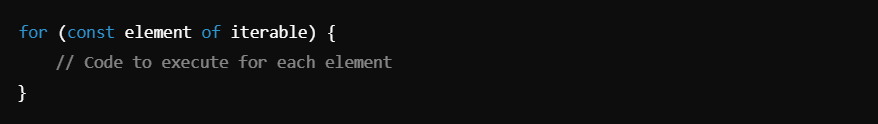
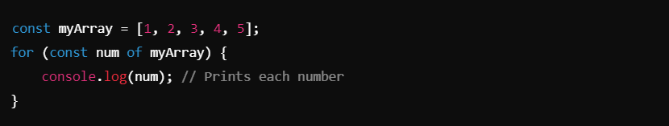
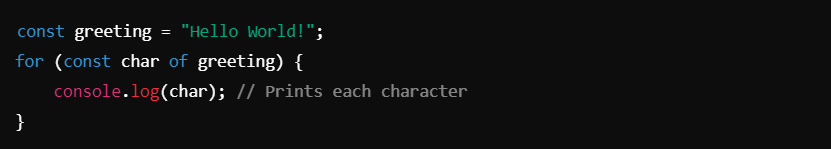
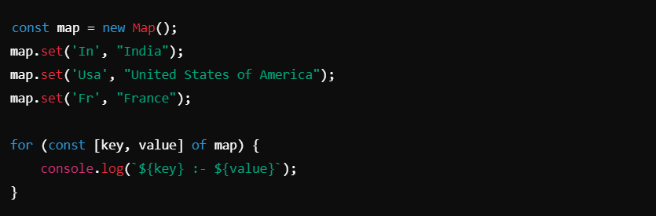
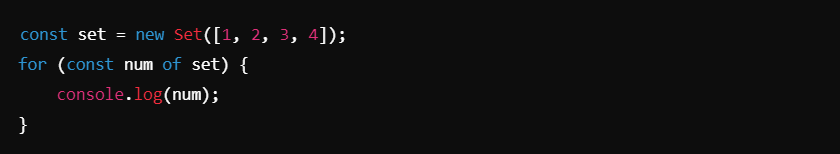
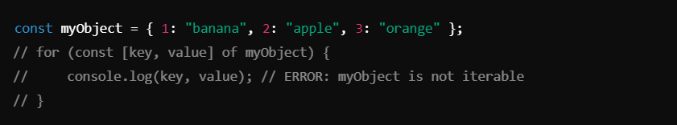
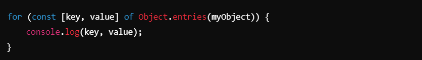
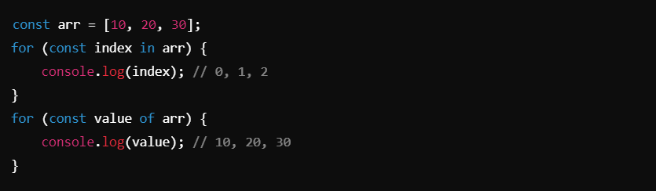

# `for ...of` Loop ->

### `for...of` Loop :-
The `for...of` loop is used to iterate over iterable objects. It retrieves the values of elements from the iterable sequentially. Commonly used with arrays, strings, maps, sets, and other iterable objects.

### Key Features :-
- **Iterates Over Values**: Unlike `for...in`, which iterates over keys, `for...of` directly accesses the values.
- **Works on Iterables**: Objects must implement the `@@iterator` method (e.g., arrays, strings, maps, sets).
- **Does not work** directly on plain objects (use `for...in` or `Object.entries()` for objects).

__________________________________________________________________________________________________________________________________

##### Syntax

__________________________________________________________________________________________________________________________________

### Examples :-

1. #### Iterating Over an Array :- 

2. #### Iterating Over a String :- 

3.  **Iterating Over a Map**:  Maps store key-value pairs and are iterable.
##### Example :-

###### Output :-

4. **Iterating Over a Set** Similar to maps, sets are also iterable.
##### Example :- 

5. **Error Case: Objects** Plain objects are not iterable by default. Using `for...of` on them will throw an error.

**Solution** : Convert the object into an iterable, like an array, using `Object.entries()`:

_________________________________________________________________________________________________________________________________

### Key Notes :
1. **Iterable Objects**:
- `for...of` works on objects implementing the `Symbol.iterator` method.
- Examples: `Array`, `String`, `Map`, `Set`, `TypedArray`, `NodeList`, `arguments`.

2. **Differences Between `for...of` and `for...in`**:
- `for...of`: Iterates over values of iterable objects.
- `for...in`: Iterates over keys/properties of an object

##### Example :

3. **Benefits of `for...of`**:
- Cleaner syntax for working with iterables.
- Automatically handles the internal indexing (e.g., no manual `i++`).

4. **Limitations**:
- Does not work on plain objects directly.
- For objects, use `Object.keys()`, `Object.values()`, or `Object.entries()`.

Best Use Cases:
Arrays, strings, maps, sets, or any iterable object requiring value-based iteration.

__________________________________________________________________________________________________________________________________