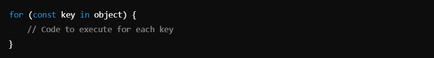
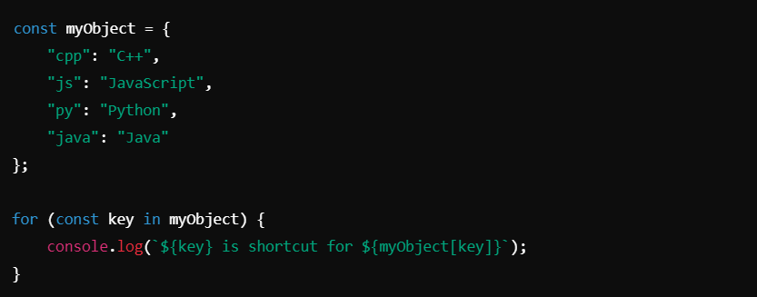
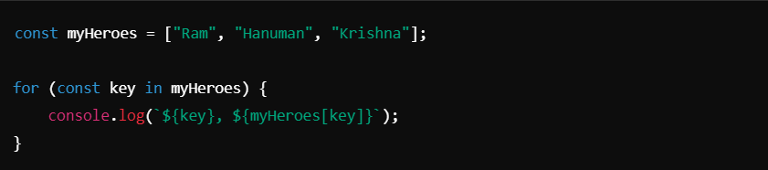
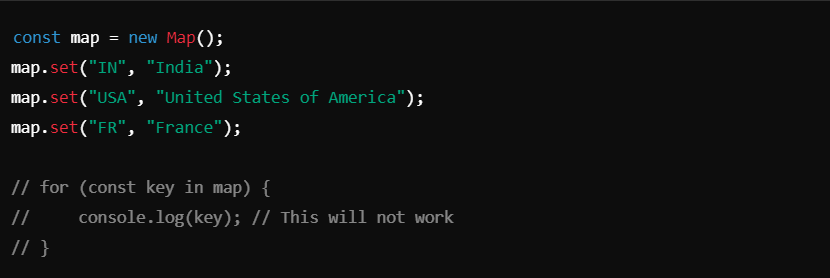
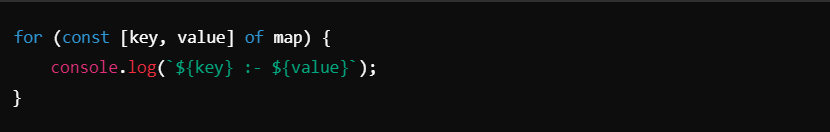
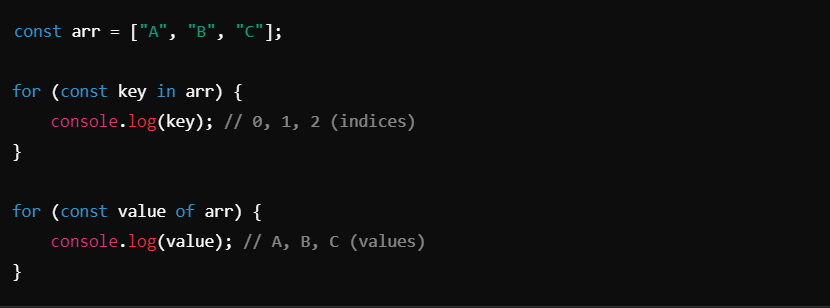

# `for ...in `Loop ->

### `for ...in` Loop :-
The `for...in` loop iterates over the keys (**enumerable properties**) of an object. It is commonly used to loop through the properties of plain objects or indices of arrays.

### Key Features :-
- **Iterates Over Keys**: The `for...in` loop retrieves keys of an object or indices of an array.
- Works on objects and arrays.
- Not suitable for maps or sets, as they are not directly enumerable.

__________________________________________________________________________________________________________________________________

##### Syntax :-

_________________________________________________________________________________________________________________________________

##### Examples :-
1. **Using `for...in` on an Object**

##### Output:

2. **Using `for...in` on an Array When used on an array, for...in iterates over the indices (keys) of the array.**
##### Example :

##### Output:

- **Important Note**: If you need values, prefer `for...of` for arrays, as `for...in` might behave unexpectedly with non-numeric properties.

3. **`for...in` on a Map The `for...in` loop does not work on maps because maps are not directly enumerable.**
##### Example:

- To iterate over a map, use `for...of`:

_________________________________________________________________________________________________________________________________

### Key Notes

1. **Objects**:
- Best suited for iterating over the keys of an object.
- Can be used to access both keys and their corresponding values.

2. **Arrays**:
- Iterates over the indices (keys) of an array, not the values directly.
- Use with caution: `for...in` might include unexpected inherited properties.

3. **Difference Between `for...in` and `for...of`**:
- `for...in`: Iterates over the keys of an object or indices of an array.
- `for...of`: Iterates over the values of an iterable object (e.g., arrays, maps, strings).
##### Example Comparison:

4. **Maps and Sets**:
- `for...in` does not work on maps or sets. Use `for...of` with destructuring.

5. **Use Cases**:
- `for...in`: Enumerating object keys or indices in arrays.
- `for...of`: Iterating over values in arrays, strings, maps, or sets.

_________________________________________________________________________________________________________________________________