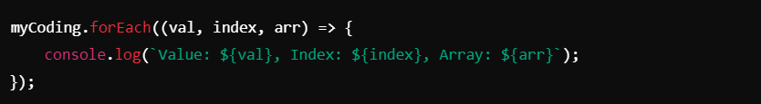

# `forEach` Loop ->

### `forEach` Method
The `forEach` method is a built-in function in JavaScript used to iterate over the elements of an array. It executes a callback function once for each array element in order.

## Key Features :
1. Executes the callback function for each element in the array.
2. The callback receives three arguments:
- `value`: The current element being processed.
- `index` (optional): The index of the current element.
- `array` (optional): The array that `forEach` is iterating over.
Does not return a value (unlike `map` or `filter`).
Does not break or skip iterations (unlike `for` loops with `break` or `continue`).

_________________________________________________________________________________________________________________________________

##### Syntax :-

__________________________________________________________________________________________________________________________________

##### Example:
1. **Basic `forEach` with Normal Function**

2. **`forEach` with Arrow Function**

3. **Using an External Function with `forEach`**

4. **Using All Parameters in `forEach`**

5. **Iterating Over an Array of Objects**

_________________________________________________________________________________________________________________________________

### Key Notes :-
1. **Callback Function**:
- The `forEach` method requires a callback function.
- The callback is executed once for every element in the array.

2. **Parameters in Callback**:
- `value`: The current array element.
- `index`: The position of the element in the array.
- `array`: The entire array being iterated over.

3. **Does Not Return**:
- The `forEach` method does not return a new array or any value.
- If you need a new array, consider using methods like `map`.

4. **No Break or Continue**:
- Unlike `for` or `while` loops, `forEach` does not support `break` or `continue`.
- If you need to break out of a loop, use `for` or `for...of`.

5. Works Only on Arrays:
- `forEach` is designed for arrays. To iterate over objects, convert the object into an array using methods like `Object.entries()`.

6. **Use Cases**:
- Performing actions on every element of an array.
- Printing or logging values.
- Modifying elements in-place (though `map` is preferred for this).

________________________________________________________________________________________________________________________________

### Comparison: `forEach` vs `map`:

_________________________________________________________________________________________________________________________________

### Best Practices
- Use `forEach` for side effects (e.g., logging, modifying).
- Avoid using it when you need to stop or skip iterations.
- Use `map` if a transformed array is required.

_________________________________________________________________________________________________________________________________