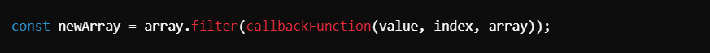
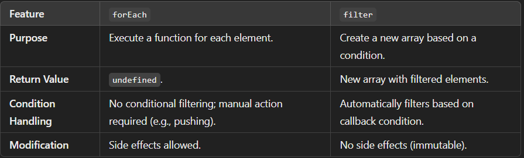
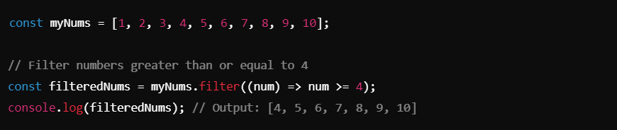
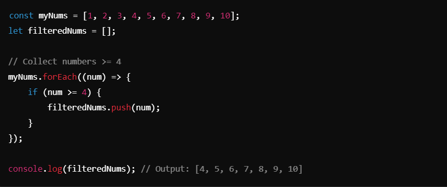
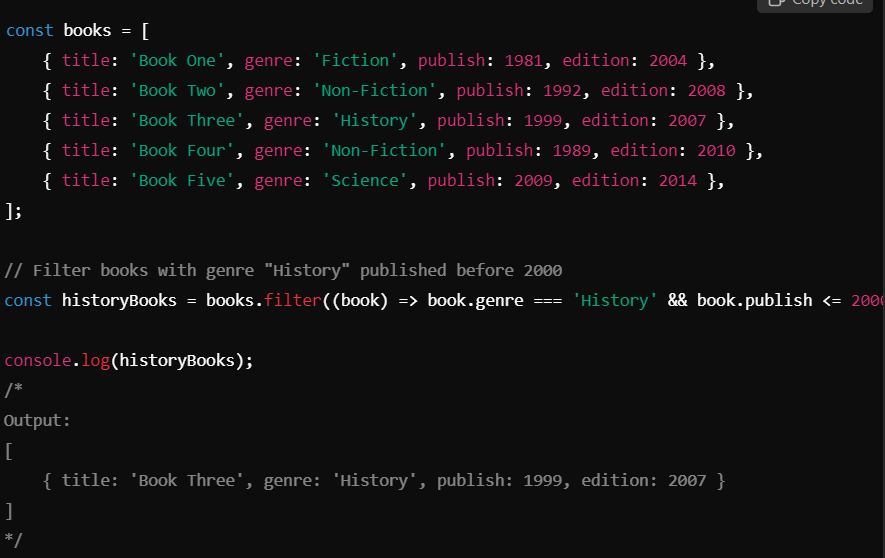

# Filter Loop ->

## `filter` :-
The `filter` method creates a new array by including only the elements that pass a given condition (truthy values). It is used to derive a subset of an array based on a specific condition.

## Key Features of `filter`
1. Returns a new array containing elements that satisfy the condition in the callback.
2. Does not modify the original array.
3. Stops iterating elements that fail the condition.
4. Suitable for:
- Filtering elements by condition.
- Creating new arrays.

_________________________________________________________________________________________________________________________________

##### Syntax

_________________________________________________________________________________________________________________________________

## Comparison of `forEach` vs `filter`

__________________________________________________________________________________________________________________________________

### Examples :
#### Example 1: Using `filter` for Condition-Based Filtering

_________________________________________________________________________________________________________________________________

#### Example 2: Using `forEach` to Mimic `filter`

__________________________________________________________________________________________________________________________________

#### Example 3: Filtering Objects in an Array

__________________________________________________________________________________________________________________________________

## Key Notes

1. **`forEach` vs `filter`: When to Use**
- Use forEach when you want to perform an action for each element (e.g., logging, modifying another array).
- Use filter when you want to create a new array based on a condition.

2. **Immutability in `filter`**:
- Original array remains unchanged.
- Useful for functional programming and avoiding side effects.

3. **Performance:**
- `filter` is more concise and efficient for creating subsets.
- `forEach` requires manual handling (e.g., pushing elements to a new array).

4. **Nested Objects:**
- `filter` can also work on arrays of objects based on property conditions.

__________________________________________________________________________________________________________________________________

## Conclusion
- Prefer `filter` when creating a new filtered array.
- Use `forEach` for executing side effects or when a return value is unnecessary.

__________________________________________________________________________________________________________________________________

