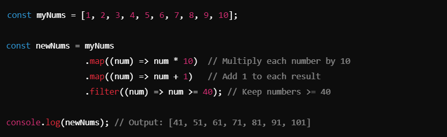
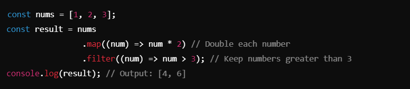

# `map` ->

## `map` Method :-
The `map` method creates a new array by applying a provided function to each element of the original array. It is often used for transforming or modifying data in an array.

## Key Features of `map`
1. Executes the callback function for **every element** in the array.
2. Returns a **new array** containing the results of applying the callback to each element.
3. The original array remains unchanged.
4. Commonly used for **data transformation** tasks.

__________________________________________________________________________________________________________________________________

#### Syntax:

_________________________________________________________________________________________________________________________________

#### Code Example :

_________________________________________________________________________________________________________________________________

#### Detailed Explanation of the Example

1. **Step 1**: `map((num) => num * 10)`
Multiplies each number in the array by `10`.
Result: `[10, 20, 30, 40, 50, 60, 70, 80, 90, 100]`.

2. **Step 2**: `map((num) => num + 1)`
Adds `1` to each number in the intermediate array.
Result: `[11, 21, 31, 41, 51, 61, 71, 81, 91, 101]`.

3. **Step 3**: `filter((num) => num >= 40)`
Filters out numbers less than `40`.
Result: `[41, 51, 61, 71, 81, 91, 101]`.

________________________________________________________________________________________________________________________________

## Key Notes ->

1. **Purpose of `map`**:
- Used for **data transformation**.
- The callback function determines how each element will be modified.

2. **Chaining Methods**:
- `map` can be combined with other methods like `filter`, `reduce`, etc., for advanced data manipulation.
##### Example :

3. **Immutability**:
- `map` does not modify the original array.
- The result is always stored in a new array.

4. **Difference Between `map` and `forEach`**:
- `map`: Returns a new array and is used for data transformation.
- `forEach`: Does not return anything and is used for side effects like logging.

5. **Works with Chaining**:
- `map` is often chained with other methods to create pipelines for processing data.

__________________________________________________________________________________________________________________________________

## Use Cases
- Modifying or transforming an array of data.
- Creating derived values from an array (e.g., doubling numbers, extracting specific fields).
- Preparing data for display (e.g., formatting strings, calculations).

_________________________________________________________________________________________________________________________________

## Best Practices
- Use `map` when you need a new array based on some transformation.
- Avoid side effects inside `map`; use `forEach` instead for actions like logging.
- Chain `map` with other methods like `filter` for complex data transformations.

_________________________________________________________________________________________________________________________________

## Conclusion
The `map` method is a powerful tool for transforming arrays efficiently and immutably. It is widely used in JavaScript for functional programming tasks and is especially useful when combined with other array methods like `filter` and `reduce`.

__________________________________________________________________________________________________________________________________
