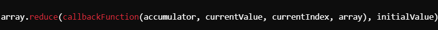
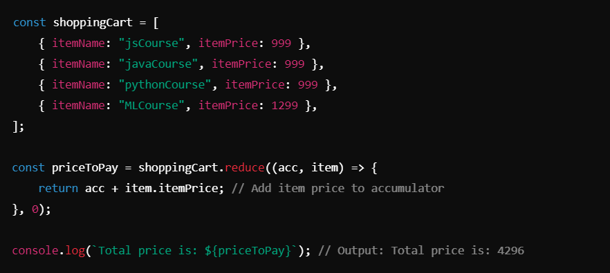
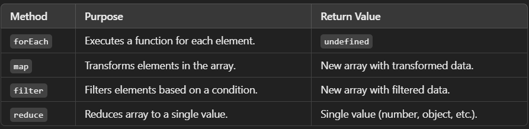

# `reduce` Method ->

## `reduce` Method :
The `reduce` method applies a reducer function to each element of an array, resulting in a single output value. It is commonly used for aggregating array elements, such as summing numbers, concatenating strings, or transforming arrays into objects.

## Key Features of `reduce` :
1. **Reduces the array** to a single value by applying the reducer function iteratively.
2. Accepts two arguments:
- `Accumulator`: The result accumulated so far.
- `Current Value`: The current element being processed.
3. Can take an optional initial value for the accumulator.

__________________________________________________________________________________________________________________________________

#### Syntax :

__________________________________________________________________________________________________________________________________

## Example : Calculating Total Price :

## Detailed Explanation of Example :
1. **Initial Value**:
- The initial accumulator value is 0.

2. **Iteration**:
- For each object in the shoppingCart array, the itemPrice is added to the accumulator.

3. **Final Result**:
- The sum of all itemPrice values is returned.

__________________________________________________________________________________________________________________________________

## Key Notes

1. **Purpose of `reduce`**:
- Aggregates array data into a single value.
- Can be used for numerical operations, creating objects, or performing transformations.

2. **Parameters**:
- `Accumulator`: Tracks the running total or result of all iterations.
- `Current Value`: The current element being processed in the array.
- `Initial Value`: Specifies the starting value for the accumulator. If omitted, the first element is used as the initial value.

3. **Common Use Cases**:
- Summing numbers.
- Flattening arrays (e.g., reducing nested arrays into one).
- Counting occurrences of values.
- Grouping data into objects.

4. **Immutability**:
- The original array remains unchanged.
- Always returns a new value.

__________________________________________________________________________________________________________________________________

## Difference Between `reduce` and Other Array Methods :

_________________________________________________________________________________________________________________________________

## Best Practices
1. Always provide an initial value to avoid unexpected results.
2. Keep reducer functions simple and concise for readability.
3. Use `reduce` when transforming or aggregating data is the primary goal.

_________________________________________________________________________________________________________________________________

## Conclusion
The `reduce` method is a powerful tool for reducing an array to a single value, enabling you to perform advanced transformations and aggregations efficiently. Proper use of `reduce` can simplify complex data operations in JavaScript.

_________________________________________________________________________________________________________________________________