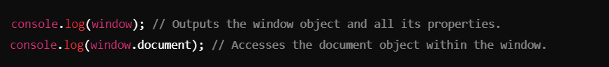
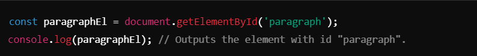
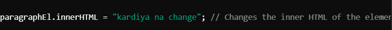
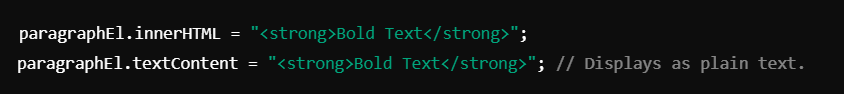

## DOM (Document Object Model) and `document` Object ->
__________________________________________________________________________________________________________________________________

### DOM (Document Object Model) :
The **Document Object Model (DOM)** is a programming interface for web documents. It represents the structure of a web page as a tree of objects, allowing developers to manipulate content, structure, and styles dynamically using JavaScript.

#### `window` Object
1. The `window` object represents the browser's global object, which acts as the top-level object in JavaScript.
2. It provides access to:
-    Browser functionality (e.g., `window.alert`, `window.location`, etc.).
-    The `document` object (a property of `window`).

##### Code Example :

_________________________________________________________________________________________________________________________________

#### `document` Object
- The `document` object represents the HTML document loaded into the browser. It allows direct interaction with the web page.

_________________________________________________________________________________________________________________________________

### Key Operations and Notes :-
1. **Accessing `document`**:
-    Use `document` to interact with the content of a web page.
-    Example:
-    

2. **Inspecting `document`**:
-    Use `console.dir(document)` for a detailed view of the `document` object as an interactive list of properties and methods.

3. **Accessing Elements**:
-    **HTMLCollection**:
-    Elements like `document.links`, `document.images`, and `document.forms` return an **HTMLCollection**.
-    **HTMLCollection** is not an array but is array-like (can be accessed via an index).
###### Example:

4. **Selecting Elements by ID**:
- Use `document.getElementById()` to retrieve an element by its `id` attribute.
###### Example:

5. **Changing Content Dynamically**:
- You can modify an element’s content using properties like `innerHTML` or `textContent`.
###### Example:

__________________________________________________________________________________________________________________________________

## Key Notes
1. **Difference Between** `innerHTML` and `textContent`:
- `innerHTML`:
- Includes HTML tags and parses them.
- Allows inserting HTML elements dynamically.

- `textContent`:
- Only includes plain text (ignores HTML tags).
- Safer as it avoids parsing HTML.

###### Example :

2. **HTMLCollection vs Array**:
- **HTMLCollection** is a live collection of DOM elements.
- You cannot directly use array methods like `map` or `filter` on an HTMLCollection.
- Use `Array.from()` to convert it into a proper array.

3. **Best Practices**:
- Use `id` for uniquely identifying elements for quick access.
- Use `innerHTML` cautiously, as it may expose the page to Cross-Site Scripting (XSS) vulnerabilities.

4. **Common Properties and Methods**:
- `document.links`: Access all `<a>` elements.
- `document.images`: Access all `` elements.
- `document.forms`: Access all `<form>` elements.

_________________________________________________________________________________________________________________________________

## Conclusion
The `document` object is a key component of the DOM, allowing developers to interact with and manipulate a webpage's structure and content. By leveraging its methods and properties, you can dynamically create, update, and manage the elements of a webpage, enhancing interactivity and user experience.

__________________________________________________________________________________________________________________________________