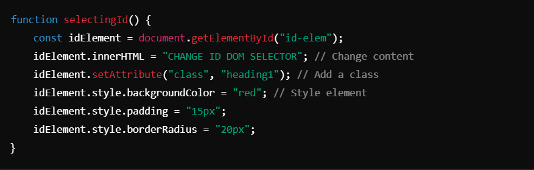
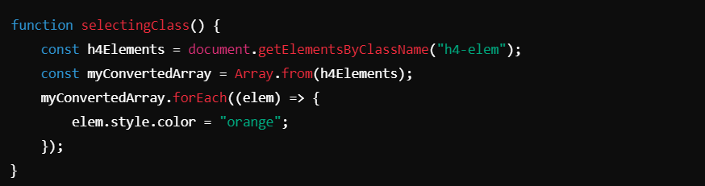
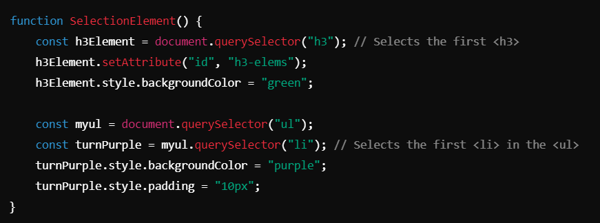
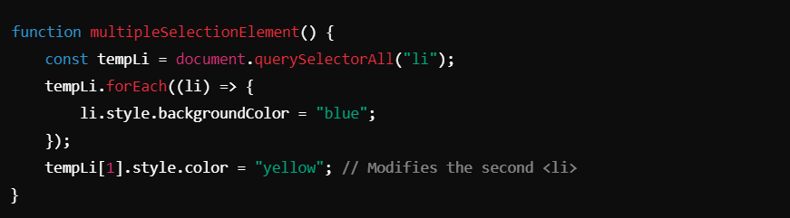
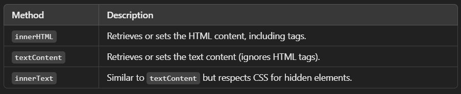
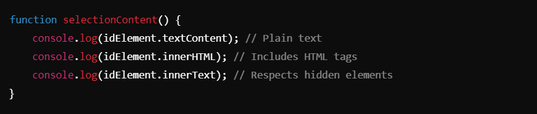

# DOM SELECTOR (Document Object Model) ->

### What is DOM?
The **Document Object Model (DOM)** is a programming interface for HTML and XML documents. It represents a web page as a hierarchical tree structure, where each node represents part of the document (e.g., elements, attributes, text). Using the DOM, developers can dynamically manipulate the structure, style, and content of a webpage with scripting languages like JavaScript.

## Key DOM Operations
1. #### Selecting Elements
The DOM provides various methods to select elements based on their ID, class, tag, or other attributes.

----------------------------------------------------------------------------------------------------------------------------------

#### Selecting by ID
- Use `document.getElementById(id)` to select an element with a specific `id` attribute.

##### Code Example 

##### Notes:
- `innerHTML`: Updates the content of the element.
- `getAttribute()`: Retrieves the value of an attribute.
- `setAttribute()`: Sets or updates an attribute value.
- `style`: Modifies inline styles dynamically.

----------------------------------------------------------------------------------------------------------------------------------

#### Selecting by class :
- Use `document.getElementsByClassName(className)` to select elements with a specific class.
- The result is an HTMLCollection, which must be converted into an array for array methods.

###### Code Example :

- **Notes**:
- `getElementsByClassName` returns a live collection (updates automatically when DOM changes).
- Convert to an array using `Array.from()` to use methods like `forEach`.

---------------------------------------------------------------------------------------------------------------------------------

#### Selecting by Query :
- Use `document.querySelector(selector)` to select the **first matching element**.
- Use `document.querySelectorAll(selector)` to select **all matching elements** as a NodeList.

###### Code Example :

##### Notes:
- `querySelector` and `querySelectorAll` allow complex CSS-style selectors (e.g., `input[type="password"]`).
- **NodeList** from `querySelectorAll` supports `forEach`.

---------------------------------------------------------------------------------------------------------------------------------

#### Changing Multiple Elements :
- Use `document.querySelectorAll` to modify multiple elements simultaneously.

##### Code Example:

##### Notes:
- `querySelectorAll` is ideal for batch processing elements.
- Use indexes to target specific elements in the NodeList.

----------------------------------------------------------------------------------------------------------------------------------

#### Content Manipulation :
- Use `innerHTML`, `textContent`, and `innerText` to retrieve or modify content.

##### Example:

---------------------------------------------------------------------------------------------------------------------------------

### Best Practices

1. **Minimize Use of `innerHTML`**:
- Avoid using `innerHTML` unless necessary, as it can expose the page to Cross-Site Scripting (XSS) vulnerabilities.

2. **Efficient DOM Manipulation**:
- Use `querySelector` and `querySelectorAll` for flexible and consistent element selection.
- Prefer batch processing (e.g., `forEach` on NodeLists) when modifying multiple elements.

3. **Class and ID Selection**:
- Use IDs (`getElementById`) for unique elements.
- Use classes (`getElementsByClassName` or `querySelectorAll`) for grouped elements.

---------------------------------------------------------------------------------------------------------------------------------

## Conclusion

The DOM is a powerful interface for manipulating web pages dynamically. By mastering element selection, content manipulation, and style changes, developers can create highly interactive and responsive web applications. Proper selection methods and content safety practices ensure efficient and secure DOM operations.

--------------------------------------------------------------------------------------------------------------------------------