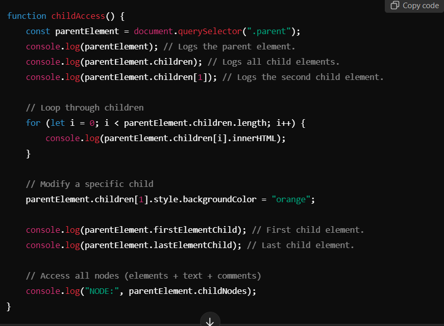
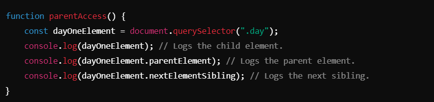
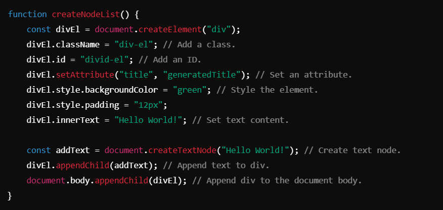

# DOM Parent-Child-Sibling Access ->

## 1. Accessing Child Elements from a Parent
Child elements can be accessed from their parent using the DOM properties like `children`, `firstElementChild`, and `lastElementChild`.

### Key Methods and Properties:
- `children`: Retrieves all child elements (ignores text nodes and comments).
- `childNodes`: Retrieves all child nodes, including elements, text nodes, and comments.
- `firstElementChild`: Accesses the first child element.
- `lastElementChild`: Accesses the last child element.

#### Code Example :

#### Notes:
- Use `children` for element-only access, while `childNodes` includes non-element nodes.
- Use `.style` to dynamically style specific children.

---------------------------------------------------------------------------------------------------------------------------------

## 2. Accessing Parent and Sibling Elements from a Child
A child element can access its parent and siblings using `parentElement`, `nextElementSibling`, and `previousElementSibling`.

### Key Methods and Properties:
- `parentElement`: Gets the parent element of the current node.
- `nextElementSibling`: Accesses the next sibling element.
- `previousElementSibling`: Accesses the previous sibling element.

#### Code Example:

#### Notes:
- Sibling navigation skips non-element nodes (like text nodes or comments).
- Use `parentElement` to traverse upwards in the DOM hierarchy.

----------------------------------------------------------------------------------------------------------------------------------

## 3. Creating and Appending Nodes
The DOM allows dynamic creation and manipulation of elements using methods like `createElement`, `createTextNode`, and `appendChild`.

### Key Methods:

- `document.createElement(tagName)`: Creates a new HTML element.
- `document.createTextNode(text)`: Creates a text node.
- `appendChild(node)`: Appends a child node to the parent.

#### Code Example:

#### Notes:
- Use `createElement` to dynamically create new elements.
- Use `setAttribute` to add attributes to the created elements.
- Appending a node to the document makes it visible on the webpage.

---------------------------------------------------------------------------------------------------------------------------------

## Best Practices

1. **Efficient Traversal**:
- Use `children` and `childNodes` based on the type of content you need (elements vs. all nodes).
- Use `parentElement` for upward traversal.

2. **Avoid Inline Styling**:
- Prefer CSS classes over JavaScript inline styles for easier maintenance.

3. **Dynamic DOM Manipulation**:
- Use `createElement` and `appendChild` for building elements dynamically.
- Avoid repetitive DOM access; store references in variables for better performance.

4. **Node Safety**:
- Always check for the existence of elements or attributes before manipulating them to avoid runtime errors.

----------------------------------------------------------------------------------------------------------------------------------

## Conclusion
The DOM provides robust methods to traverse, manipulate, and create elements dynamically. By mastering parent-child-sibling relationships and node creation, developers can build interactive and responsive web pages effectively.

----------------------------------------------------------------------------------------------------------------------------------

