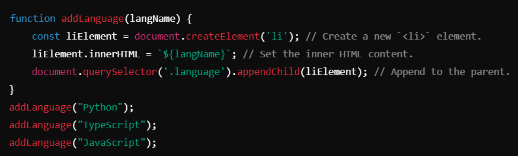
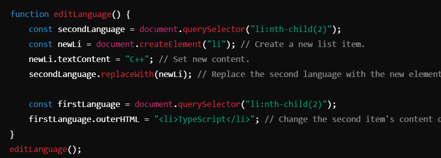
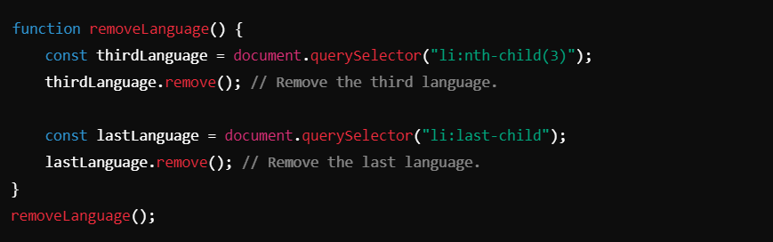

# DOM Manipulation for Adding, Editing, and Removing Elements ->

## 1. Adding Elements to the DOM :
You can dynamically add elements to a webpage using JavaScript. This is done by creating new elements with `createElement`, setting their content, and appending them to the desired parent element using `appendChild`.

### Key Methods:
- `document.createElement(tagName)`: Creates a new HTML element.
- `appendChild(node)`: Adds a child node to a parent element.
- `createTextNode(text)`: Creates a text node for plain text content.

#### Code Example for Adding Elements:

#### Notes:
- Use `appendChild` to add elements as the last child of the parent.
- Use `createTextNode` for pure text content to avoid unexpected HTML injection.

_________________________________________________________________________________________________________________________________

## 2. Editing Existing Elements :
- Replacing the content of an element (`innerHTML`, `textContent`).
- Replacing an entire element using `replaceWith`.
- Changing an element’s outer HTML with `outerHTML`.

#### Code Example for Editing Elements:

#### Notes:
- Use `replaceWith` for swapping elements dynamically.
- `outerHTML` can replace an element entirely, but be cautious as it overwrites the structure.
- Prefer `textContent` over `innerHTML` when dealing with plain text to prevent script injection vulnerabilities.

__________________________________________________________________________________________________________________________________

## 3. Removing Elements from the DOM
Elements can be removed from the DOM using the `remove` method. This directly deletes the node from its parent.

### Key Methods:
- `remove()`: Deletes the element from the DOM.
- `removeChild(childNode)`: Removes a specific child node from the parent.

#### Code Example for Removing Elements:

#### Notes:
- `remove` is straightforward and directly removes the element.
- For older browsers that don't support `remove`, use `parentNode.removeChild`.

__________________________________________________________________________________________________________________________________

## Best Practices:

1. **Dynamic Content**:
- Always validate and sanitize dynamic content to prevent script injection when using `innerHTML`.

2. **Performance Optimization**:
- Minimize DOM access by storing references to frequently accessed elements.
- Use `documentFragment` for batch updates to improve performance.

3. **Readable Code**:
Use meaningful function names like `addLanguage` or `removeLanguage` for better maintainability.

4. **Cross-Browser Compatibility**:
- Ensure compatibility with older browsers by testing features like `remove` and using polyfills if needed.

__________________________________________________________________________________________________________________________________

## Conclusion
DOM manipulation allows developers to dynamically add, edit, and remove elements from the webpage, enabling the creation of interactive web applications. By using methods like `createElement`, `replaceWith`, and `remove`, you can efficiently manage the structure and content of your web pages.

________________________________________________________________________________________________________________________________