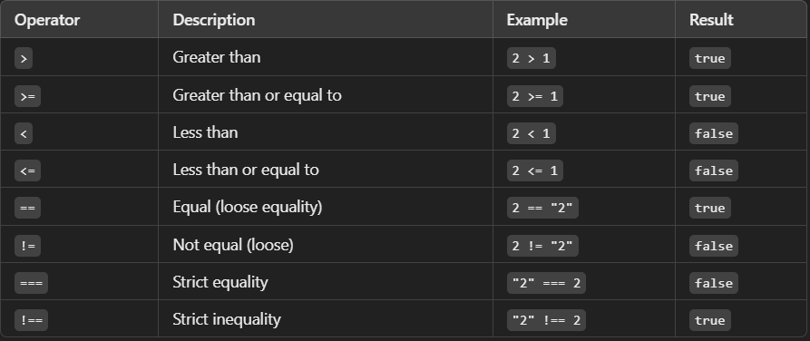
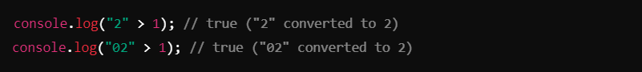
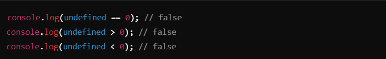
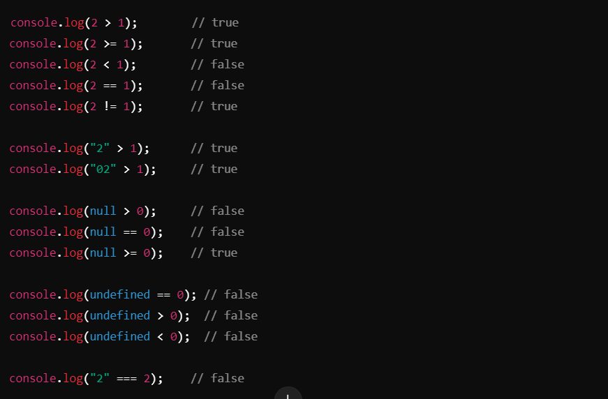

# Comparison Operators in JavaScript ->
JavaScript comparison operators are used to compare values. They return a Boolean value (true or false) depending on the result of the comparison.

# Common Comparison Opertors :- 

## Key Notes
1. ### Loose Equality (`==`):
- Compares values after type coercion.
- Example :
- 

2. ### Strict Equality (===):
- Compares values *without type coercion*. Both value and type must match.
- Example:
- 

3. ### Comparing Strings with Numbers:
- Strings are converted to numbers when compared with numeric operators (`>`, `<`, etc.).
- Example:
- 

4. ### Comparing `null`:
- Special behavior:
- `null > 0` → `false`
- `null == 0` → `false`
- `null >= 0` → `true`
- Explanation: `null` is loosely equal to `undefined` but not to any number.

5. ### Comparing `undefined` :
`undefined` is not equal to any number, and all comparisons with numbers result in `false`.
- Example:
- 

## Examples and Behavior
- 

## Summary
- Use `==` for loose equality, but be cautious of type coercion.
- Prefer `===` for strict equality to avoid unexpected behavior.
- Comparisons with `null` and `undefined` have special rules; avoid using them in mathematical comparisons.
- Strings are converted to numbers during comparisons with numeric operators.